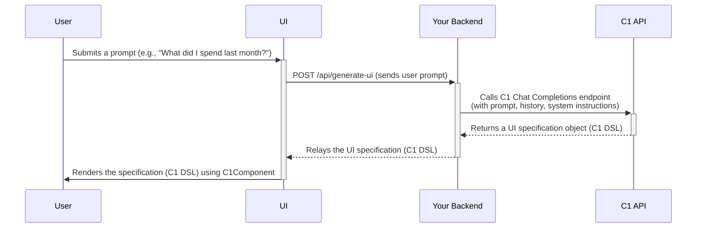
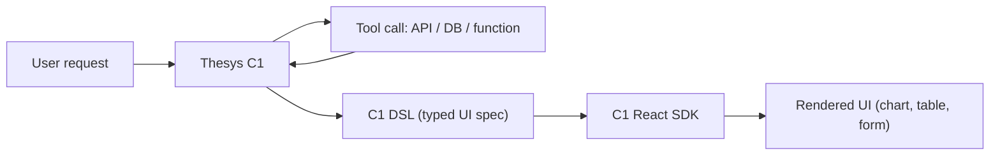
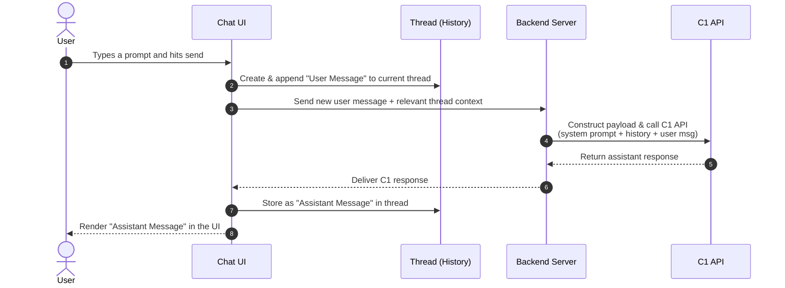
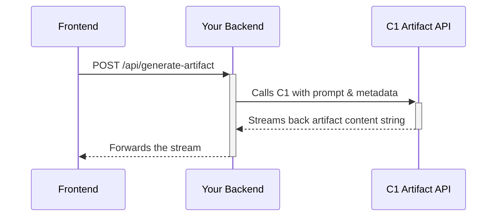
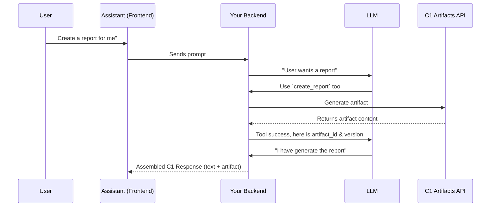
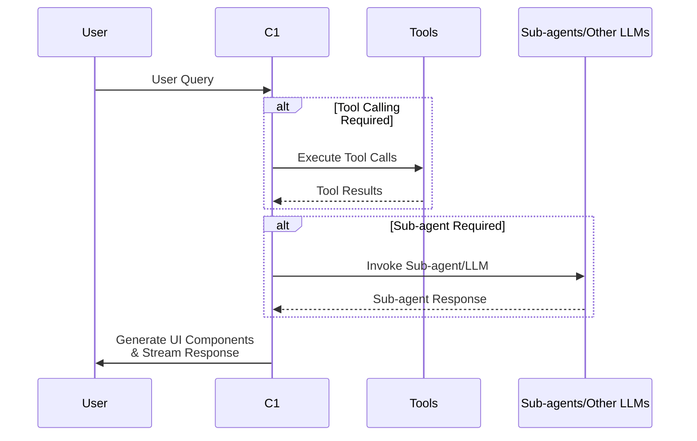
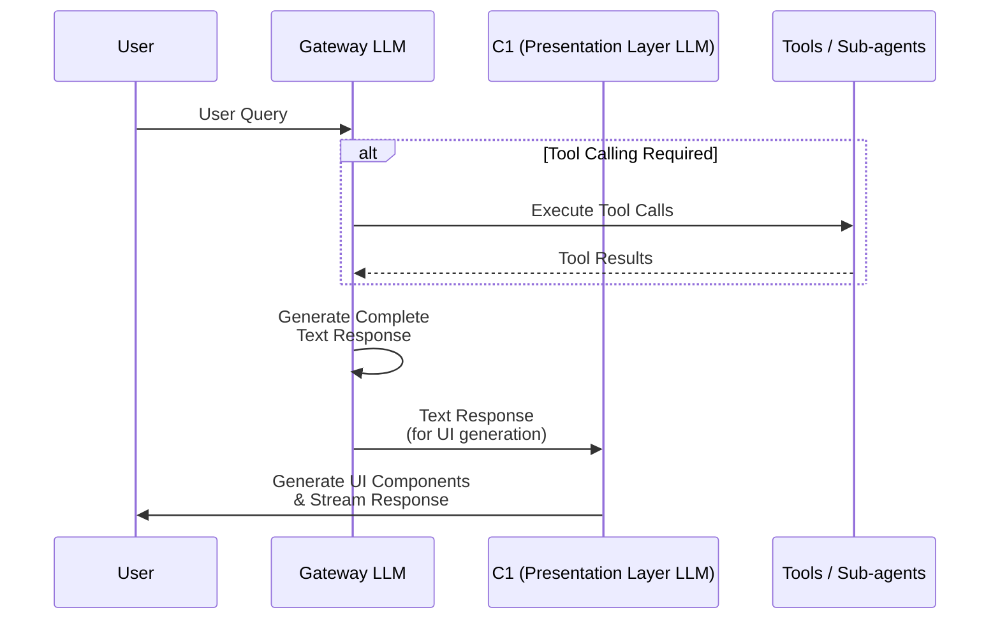
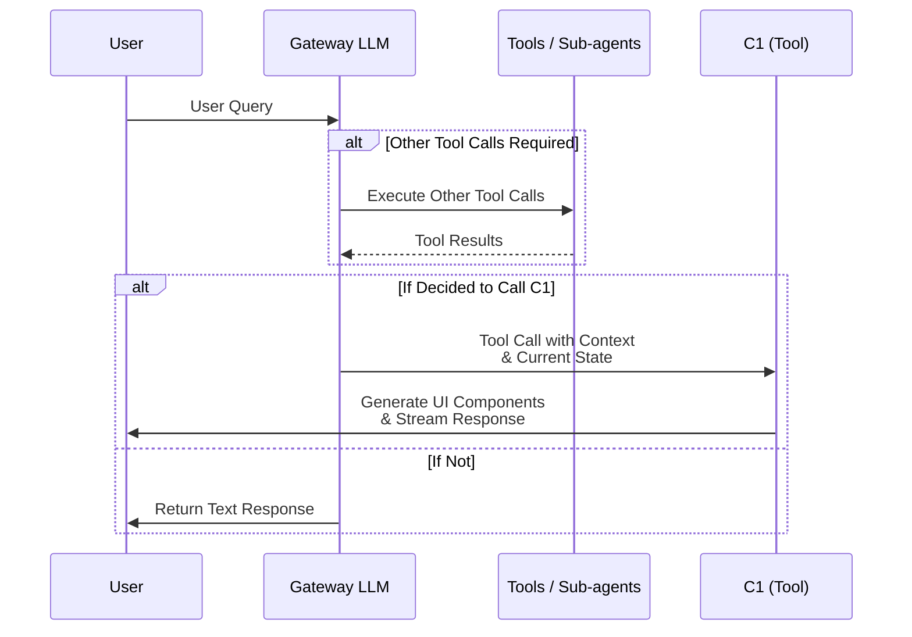

# What is C1 by Thesys?

> the Generative UI API for AI-native applications.

## Introduction

Large Language Models (LLMs) are powerful tools for processing and generating text. However, when building AI-native applications, relying solely on text-based responses often limits user experience and functionality. Traditionally, transforming an LLM's output into a rich, interactive user interface requires extensive manual coding on the UI.

**Generative UI** is a paradigm shift where AI dynamically generates the user interface itself.

Thesys provides [C1 API](/guides/implementing-api) and [React SDK](/guides/rendering-ui) to bring Generative UI to your applications.
With C1, you can send a natural language prompt, and the API will generate and stream live, interactive UI components directly into your client application.

<iframe width="560" height="315" src="https://www.youtube.com/embed/nkN1ItymLHI" title="YouTube video player" frameBorder="0" allow="accelerometer; autoplay; clipboard-write; encrypted-media; gyroscope; picture-in-picture; web-share" allowFullScreen />

## See it in action

To understand how C1 works, consider a practical example. You can send a natural language prompt like the one below directly to the C1 API.

<Card title="Try it out live" href="https://demo.thesys.dev/compare?reset=true" arrow="true" img="https://mintcdn.com/thesys/Dewe7WWH-g55hogM/images/c1-compare.png?fit=max&auto=format&n=Dewe7WWH-g55hogM&q=85&s=f738eda553b387ef7b82cc3d5426c980" data-og-width="3600" width="3600" data-og-height="2320" height="2320" data-path="images/c1-compare.png" data-optimize="true" data-opv="3" srcset="https://mintcdn.com/thesys/Dewe7WWH-g55hogM/images/c1-compare.png?w=280&fit=max&auto=format&n=Dewe7WWH-g55hogM&q=85&s=f05fbd67b7c759b0957ac3c63edb0d7b 280w, https://mintcdn.com/thesys/Dewe7WWH-g55hogM/images/c1-compare.png?w=560&fit=max&auto=format&n=Dewe7WWH-g55hogM&q=85&s=b38d03a6d837677f861df971f202b047 560w, https://mintcdn.com/thesys/Dewe7WWH-g55hogM/images/c1-compare.png?w=840&fit=max&auto=format&n=Dewe7WWH-g55hogM&q=85&s=0c767229b69bacf9e2222d92c3699cf2 840w, https://mintcdn.com/thesys/Dewe7WWH-g55hogM/images/c1-compare.png?w=1100&fit=max&auto=format&n=Dewe7WWH-g55hogM&q=85&s=dcb41befbdd98b9460df7df5caf1ca12 1100w, https://mintcdn.com/thesys/Dewe7WWH-g55hogM/images/c1-compare.png?w=1650&fit=max&auto=format&n=Dewe7WWH-g55hogM&q=85&s=a3241cfb3339e8b1517b3eeaab6b0420 1650w, https://mintcdn.com/thesys/Dewe7WWH-g55hogM/images/c1-compare.png?w=2500&fit=max&auto=format&n=Dewe7WWH-g55hogM&q=85&s=a4b682784625c8b1b6f90e477aae8cac 2500w">
  Live interactive demo of C1 in action
</Card>

## Key Features

* **Interactive Components** \
  The generated UI is not static. C1 natively supports a range of interactive elements, including charts with tooltips, clickable elements that continue the conversation and forms that can capture user input to trigger subsequent actions.

* **Themeable** \
  The generated UI seemlessly adapts to your brand with a custom theme. Dark mode is supported out of the box.

* **Real-time UI Streaming** \
  C1 streams the UI as it's generated, not after. This allows components to appear on the screen progressively, creating a more responsive and fluid user experience without waiting for the full response to be ready.

* **OpenAI-Compatible API** \
  The API is designed for seamless backend integration. By using the familiar OpenAI SDKs, you can adopt C1 with minimal changes to your existing code. On the UI, [C1 React SDK](/guides/rendering-ui) replaces a traditional markdown renderer.

* **Robust Error Handling**
  * LLM providers might go down but C1 won't. C1 internally retries the request or routes to fallback providers, so your users are not affected.
  * LLM might generate incomplete or invalid response. C1 detects this and seemlessly fixes it in realtime.

## What can I build with it

* **Analytics dashboards**
  *“Show me monthly revenue trends”* → live line chart.

* **Conversational agents**
  *“Book me a flight and confirm details”* → multi-step form in chat.

* **Internal tools**
  *“List all users who signed up in the last 30 days”* → interactive table with line chart showing week-by-week growth.

* **E-commerce flows**
  *“Add this product to my cart and checkout”* → interactive checkout UI.

* **Rebuilding AI agents with Generative UI**
  Any existing AI agent - customer support bots, copilots, research assistants, or vertical-specific tools - can be reimagined with a Generative UI layer.
  Instead of limiting the agent to text-only interactions, C1 lets it generate forms, dashboards, and workflows that make the agent truly useful in production.

## FAQs

<AccordionGroup>
  <Accordion title="How is this different from Vercel AI SDK, CopilotKit, Assistant-UI, AG-UI, etc.?">
    Tools like Vercel AI SDK, CopilotKit, and AGUI mainly help you build chat-style interfaces from LLM outputs -
    but the heavy lifting of turning those text responses into actual UI still falls on developers.

    C1 by Thesys is different: it's an LLM API that generates UI directly, not just text.
    That means you can plug C1 into those frameworks (or use it on its own) and skip the manual step of
    converting model outputs into components.

    See [Frameworks](/guides/frameworks) for guides on how to integrate C1 in these frameworks.
  </Accordion>

  <Accordion title="I already have an AI agent. How do I use Thesys?">
    C1 by Thesys is designed to be a drop in replacement for any AI agent that is built on top of the OpenAI API.
    Its as simple as

    1. Change OpenAI baseURL to `api.thesys.dev/v1/embed`
    2. Replace your `<Mardown>` rendered with `<C1Component>`

    See [Migrating to GenUI](/guides/migrate-to-genui) guide for more details.
  </Accordion>

  <Accordion title="Can I use my own components / design libary?">
    Yes, absolutely! One of the core design principles of C1 is to be able to support any design system, any components.
    There are a couple of layers to be able to do this:

    * See [Styling Guide](/guides/styling) to understand how to match C1 responses to your design system.
    * [Custom Components](/guides/custom-components) helps close the last mile gap for specific components like Weather Card, Flight Seat map
      that are not supported by C1 out of the box.
  </Accordion>
</AccordionGroup>


---

> To find navigation and other pages in this documentation, fetch the llms.txt file at: https://docs.thesys.dev/llms.txt

# How C1 Works

> A detailed look at the C1 integration, from the backend API call to UI rendering.

## Overview

{/* todo: make sure to add data, logic and a message store in the flow */}

Here is a visual overview of the entire process, from a user's query to the final rendered UI:



1. User enters a prompt on the UI
2. UI sends the prompt to your backend API
3. Backend calls the C1 API with the prompt, history, system instructions.
4. C1 API returns a UI specification object (C1 DSL) which is generated by existing LLM API based on the model selected while making the call.
5. Backend relays the C1 Response to the UI
6. UI renders the C1 Response using `<C1Component />`

Let's see how integration with C1 works.

## The Backend API Call

The core integration pattern involves your backend acting as an intermediary between your UI client and the C1 API.
This allows you to add business logic, prepare data before calling C1 and secure your API keys.

The C1 API is **OpenAI-compatible**, so you can use the official `openai` client library.
If you already have openai integrated, the only change required is to configure the client with your Thesys API key and the C1 `baseURL`.

Before making the call to C1, your server can enrich the user's prompt with additional context, such as conversation history,
system instructions, or [integrate data](/guides/integrate-data/tool-calling) from your database.

<CodeGroup dropdown>
  ```python main.py theme={null}
  from openai import OpenAI
  import os

  # Create OpenAI client with Thesys endpoint
  client = OpenAI(
      api_key=os.getenv('THESYS_API_KEY'),
      base_url='https://api.thesys.dev/v1/embed'
  )

  # Now use the client for your AI requests
  response = client.chat.completions.create(
      model='<model-name>',
      messages=[
          {'role': 'user', 'content': 'Hello, world!'}
      ]
  )
  ```

  ```ts src/app/api/chat/route.ts theme={null}
  const { OpenAI } = require('openai')

  // Create OpenAI client with Thesys endpoint
  const client = new OpenAI({
    apiKey: process.env.THESYS_API_KEY,
    baseURL: 'https://api.thesys.dev/v1/embed'
  })

  // Now use the client for your AI requests
  const response = await client.chat.completions.create({
    model: '<model-name>',
    messages: [
      { role: 'user', content: 'Hello, world!' }
    ]
  })
  ```
</CodeGroup>

The response from the C1 API is a structured UI specification (C1 DSL) that is then passed back to your UI.

## UI Rendering

The C1 **React SDK** provides `<C1Component>` to handle the rendering.
It is reponsible to take the response returned from C1 and render it as interactive React components.

If you are building a chat interface, you can use [`<C1Chat>`](/guides/conversational).
It provides everything including chat history, user thread management. This drastically reduces the development time.

## C1 Response

Unlike standard LLM responses, which are plain text or markdown, a C1 Response is a string that is structured payload to contain rich content.
It uses an XML-like structure to package multiple types of content into a single string.

It is generally stored as assistant message content in the database.

```xml  theme={null}
<!-- A C1 Response can contain multiple content types -->
<thinking>...</thinking><content>...</content><artifact>...</artifact>
```

The different tags represent different parts of the response:

* `<thinking>`: Data for displaying real-time thinking-state indicators.
* `<content>`: The primary Generative UI response.
* `<artifact>`: Document-style content, such as Slides or Reports.

C1 provides backend helpers to help you create and stream this response payload. For a detailed guide on this topic please refer to [C1 response](/sdk-reference/c1-response).

C1 response can be streamed to the UI and rendered using the `<C1Component>` or `<C1Chat>` component.

## Selecting a model

The C1 API supports multiple models. You can select the model based on your use case.

Current supported models are:

1. Anthropic - Claude Sonnet 4
2. OpenAI - GPT-5

To see the full list of supported models, please refer to the [Models](/guides/models-and-compatibility) page.

## Summary

C1 gives you full control over the end-to-end experience. Your **backend** orchestrates the call by adding context and business logic.\
And your **UI** is responsible for fetching the resulting C1 Response and using the C1 SDK to render the final interactive UI.


---

> To find navigation and other pages in this documentation, fetch the llms.txt file at: https://docs.thesys.dev/llms.txt

# Quickstart

> Get started quickly with building your first Generative UI application

## Overview

This guide provides a quickstart for building your first Generative UI application with C1.

## Components

C1 provides two components for building Generative UI applications:

* `<C1Component>`: A component that renders the Generative UI.
* [`<C1Chat>`](/guides/conversational): A pre-built chat component that includes a chat history, a message composer, and a loading indicator.

If you're unsure about which component to use check our [comparison guide](/guides/c1chat-vs-c1component)
for more details.

Check out the [Basics section](/guides/basics) for further details on implementing backend API and rendering the UI.

## NextJS

The easiest way to begin is by using C1 within a [NextJS](https://nextjs.org) project

### Create with the CLI

1. Create a new app called `my-c1-project`
2. `cd my-c1-project` and start the dev server
3. Visit [http://localhost:3000](http://localhost:3000)

```bash  theme={null}
npx create-c1-app
cd my-c1-project
npm run dev
```

### System requirements

* Node.js 20.9 or later
* macOS, Windows or Linux

***

## Python

```bash  theme={null}
git clone https://github.com/thesysdev/template-c1-fastapi.git my-c1-project
```

### Start the python server

```bash  theme={null}
cd my-c1-app/backend
pip install -r requirements.txt
uvicorn main:app --reload
```

### Start the frontend server

```bash  theme={null}
cd my-c1-app/ui
npm install
npm run dev
```

### System requirements

* Node.js 20.9 or later (for the frontend server)
* Python 3.x version (for the backend server)
* macOS, Windows or Linux


---

> To find navigation and other pages in this documentation, fetch the llms.txt file at: https://docs.thesys.dev/llms.txt

Access Windsurf MCP Settings
Open Windsurf Settings (click the settings button in the bottom right)
Navigate to the "Cascade" section
Look for "Model Context Protocol" or "MCP" settings
Enable MCP support if not already enabled
Add MCP Server to Windsurf
You can add Thesys in several ways:

Using the Built-in Server Browser
In the Cascade section, click "Add Server"
Select "Add custom server"
Choose the transport type:
SSE/HTTP for remote servers
stdio for local command-based servers
Enter the server URL:
Server URL
https://thesys-kd1f.mcp.tadata.com/sse
Manual Configuration
Add the server configuration to your mcp_config.json file:

HTTP Transport
SSE Transport
stdio Transport (Local)
{
  "mcpServers": {
    "Thesys": {
      "command": "npx",
      "args": ["mcp-remote", "https://thesys-kd1f.mcp.tadata.com"],
      "disabled": false
    }
  }
}
Configuration File Location
The MCP configuration is typically stored at:

macOS: ~/.codeium/windsurf/mcp_config.json
Windows: %APPDATA%\.codeium\windsurf\mcp_config.json
Linux: ~/.config/codeium/windsurf/mcp_config.json
Using MCP Tools in Windsurf
Once configured, Thesys tools will be available in Windsurf's Cascade AI assistant:

Open the Cascade panel (AI chat interface)
The MCP tools are automatically available to the AI
You can reference specific tools using @Thesys in your conversations
Windsurf will intelligently choose which tools to use based on your requests
Managing Your MCP Servers
In the Windsurf MCP settings, you can:

Enable/Disable individual servers
View server status and connection health
Configure tool permissions and auto-approval settings
Monitor server logs for debugging
Restart servers if they become unresponsive
The AI will seamlessly integrate Thesys functionality into your development workflow!

Access Windsurf MCP Settings
Open Windsurf Settings (click the settings button in the bottom right)
Navigate to the "Cascade" section
Look for "Model Context Protocol" or "MCP" settings
Enable MCP support if not already enabled
Add MCP Server to Windsurf
You can add Thesys in several ways:

Using the Built-in Server Browser
In the Cascade section, click "Add Server"
Select "Add custom server"
Choose the transport type:
SSE/HTTP for remote servers
stdio for local command-based servers
Enter the server URL:
Server URL
https://thesys-kd1f.mcp.tadata.com/sse
Manual Configuration
Add the server configuration to your mcp_config.json file:

HTTP Transport
SSE Transport
stdio Transport (Local)
{
  "mcpServers": {
    "Thesys": {
      "command": "npx",
      "args": ["mcp-remote", "https://thesys-kd1f.mcp.tadata.com"],
      "disabled": false
    }
  }
}
Configuration File Location
The MCP configuration is typically stored at:

macOS: ~/.codeium/windsurf/mcp_config.json
Windows: %APPDATA%\.codeium\windsurf\mcp_config.json
Linux: ~/.config/codeium/windsurf/mcp_config.json
Using MCP Tools in Windsurf
Once configured, Thesys tools will be available in Windsurf's Cascade AI assistant:

Open the Cascade panel (AI chat interface)
The MCP tools are automatically available to the AI
You can reference specific tools using @Thesys in your conversations
Windsurf will intelligently choose which tools to use based on your requests
Managing Your MCP Servers
In the Windsurf MCP settings, you can:

Enable/Disable individual servers
View server status and connection health
Configure tool permissions and auto-approval settings
Monitor server logs for debugging
Restart servers if they become unresponsive
The AI will seamlessly integrate Thesys functionality into your development workflow!

# Integrating C1 in your backend

> Learn how to invoke the C1 API from your backend using OpenAI library

This guide walks you through setting up your client, structuring your API requests, and implementing the most common backend patterns for both conversational and standalone applications.

{/* todo: steps component don't show up in the LHS, need to fix this */}

## Implementation

### 1. Setup and Authentication

C1 API is designed to be fully compatible with the OpenAI Chat Completions API. The recommended way to interact with the endpoint is to use the official OpenAI client library for your preferred language.

To get started, you need to initialize the client with your **Thesys API Key** and the **C1 Base URL**.

<Note>You can create a new API key from [Developer Console](https://console.thesys.dev/keys)</Note>

<CodeGroup dropdown>
  ```python main.py theme={null}
  import os
  from openai import OpenAI

  # Initialize the client with your C1 API Key and the C1 Base URL
  client = OpenAI(
      api_key=os.environ.get("THESYS_API_KEY"),
      base_url="https://api.thesys.dev/v1/embed"
  )
  ```

  ```typescript src/app/api/chat/route.ts theme={null}
  import OpenAI from 'openai';

  // Initialize the client with your C1 API Key and the C1 Base URL
  const client = new OpenAI({
    apiKey: process.env.THESYS_API_KEY,
    baseURL: 'https://api.thesys.dev/v1/embed',
  });
  ```
</CodeGroup>

### 2. Structuring the API Request

The core of every request is the `messages` array, which provides the conversational context to the model.

The array consists of one or more message objects, each with a `role` and `content`:

* `role: 'system'`: Provides high-level instructions or context for the AI. This is typically the first message in the array.
* `role: 'user'`: Represents a prompt or message from the end-user.
* `role: 'assistant'`: Represents a previous response from the AI.

**Conversation history** is managed by including the sequence of past `user` and `assistant` messages in the array before adding the latest user prompt.

```json  theme={null}
[
    { "role": "system", "content": "You are a helpful assistant that generates UI." },
    { "role": "user", "content": "Show me last month's sales." },
    { "role": "assistant", "content": "<UI spec for a sales chart...>" },
    { "role": "user", "content": "Now break it down by region." }
]
```

You must also specify the `model` you wish to use. For a full list of available models, see the [Models and Pricing](/guides/models-and-compatibility) guide.

### 3. Implementation Patterns

Your implementation will depend on whether you are building a conversational application that needs to remember context or a standalone tool that handles one-off requests.

<Tabs>
  <Tab title="Conversational Application">
    In a conversational pattern, your backend must store and manage the history of the conversation. On each new request, you retrieve the history, add the new user message, and then save the assistant's response to persist the context.

    The following is a simplified but complete example using an in-memory array for history. In a production application, you would replace this with a database.

    <CodeGroup dropdown>
      ```python main.py (FastAPI) theme={null}
      import os
      from openai import OpenAI
      from fastapi import FastAPI
      from pydantic import BaseModel

      # --- Basic Setup ---
      app = FastAPI()
      client = OpenAI(
          api_key=os.environ.get("THESYS_API_KEY"),
          base_url="https://api.thesys.dev/v1/embed"
      )

      # In-memory store for conversation history (for demonstration purposes)
      conversation_history = [
          {"role": "system", "content": "You are a helpful assistant."}
      ]

      class ChatRequest(BaseModel):
          prompt: str

      # --- API Endpoint ---
      @app.post("/chat")
      def chat(request: ChatRequest):
          # 1. Add the new user message to the history
          conversation_history.append({"role": "user", "content": request.prompt})

          # 2. Call the C1 API with the full history
          completion = client.chat.completions.create(
              model="c1-model-name",
              messages=conversation_history,
          )
          assistant_response = completion.choices[0].message

          # 3. Add the AI's response to the history
          conversation_history.append(assistant_response)

          # 4. Return the latest response content to the frontend
          return assistant_response.content
      ```

      ```typescript route.ts (Next.js) theme={null}
      import { NextRequest, NextResponse } from "next/server";
      import OpenAI from 'openai';
      import { ChatCompletionMessageParam } from "openai/resources/index.mjs";

      // --- Basic Setup ---
      const client = new OpenAI({
        apiKey: process.env.THESYS_API_KEY,
        baseURL: 'https://api.thesys.dev/v1/embed',
      });

      // In-memory store for conversation history (for demonstration purposes)
      const conversationHistory: ChatCompletionMessageParam[] = [
          { role: "system", content: "You are a helpful assistant." }
      ];

      // --- API Endpoint ---
      export async function POST(req: NextRequest) {
        const { prompt } = (await req.json()) as { prompt: string };

        // 1. Add the new user message to the history
        conversationHistory.push({ role: "user", content: prompt });

        // 2. Call the C1 API with the full history
        const completion = await client.chat.completions.create({
          model: 'c1-model-name',
          messages: conversationHistory,
        });
        const assistantResponse = completion.choices[0].message;

        // 3. Add the AI's response to the history
        conversationHistory.push(assistantResponse);

        // 4. Return the latest response content to the frontend
        return assistantResponse.content;
      }
      ```
    </CodeGroup>
  </Tab>

  <Tab title="Standalone Request">
    For standalone tools, like generating a dashboard widget from a prompt, you don't need to manage a persistent conversation history. Each request is self-contained.

    The `messages` array is typically simpler, containing just a `system` message for context and the single `user` message.

    <CodeGroup dropdown>
      ```python main.py (FastAPI) theme={null}
      import os
      from openai import OpenAI
      from fastapi import FastAPI
      from pydantic import BaseModel

      app = FastAPI()
      client = OpenAI(
          api_key=os.environ.get("THESYS_API_KEY"),
          base_url="https://api.thesys.dev/v1/embed"
      )

      class GenerationRequest(BaseModel):
          prompt: str

      @app.post("/generate-widget")
      def generate(request: GenerationRequest):
          completion = client.chat.completions.create(
              model="c1-model-name",
              messages=[
                  {"role": "system", "content": "You generate UI widgets for a financial dashboard."},
                  {"role": "user", "content": request.prompt}
              ],
          )
          assistant_response = completion.choices[0].message
          return assistant_response.content
      ```

      ```typescript route.ts (Next.js) theme={null}
      import { NextRequest, NextResponse } from "next/server";
      import OpenAI from 'openai';

      const client = new OpenAI({
        apiKey: process.env.THESYS_API_KEY,
        baseURL: 'https://api.thesys.dev/v1/embed',
      });

      export async function POST(req: NextRequest) {
          const { prompt } = (await req.json()) as { prompt: string };

          const completion = await client.chat.completions.create({
            model: 'c1-model-name',
            messages: [
              { role: "system", content: "You generate UI widgets for a financial dashboard." },
              { role: "user", content: prompt }
            ],
          });
          const assistantResponse = completion.choices[0].message;
          return assistantResponse.content;
      }
      ```
    </CodeGroup>
  </Tab>
</Tabs>

## C1 API Reference

* **Endpoint**: `POST /chat/completions`
* **Authentication**: The API uses `Authorization: Bearer <THESYS_API_KEY>`. The client libraries handle this header for you.

### Supported Parameters

The C1 API supports the following standard OpenAI chat completion parameters:

* `model` (string, required): The model ID to use for the generation.
* `messages` (array, required): A list of message objects that form the conversation history.
* `stream` (boolean, optional): If `true`, the response will be streamed back in chunks.
* `temperature` (number, optional): Controls randomness. Defaults to 1.0.
* `max_tokens` (integer, optional): The maximum number of tokens to generate.
* `top_p` (number, optional): Nucleus sampling parameter.
* `stop` (string or array, optional): Sequences where the API will stop generating further tokens.

### Error Handling

The API returns standard HTTP status codes and an error object compatible with OpenAI's format in case of failure.

````json  theme={null}
{
  "error": {
    "message": "Invalid API key provided.",
    "type": "invalid_request_error",
    "param": null,
    "code": "invalid_api_key"
  }
}```
````


---

> To find navigation and other pages in this documentation, fetch the llms.txt file at: https://docs.thesys.dev/llms.txt

# Integrating C1 in your backend

> Learn how to invoke the C1 API from your backend using OpenAI library

This guide walks you through setting up your client, structuring your API requests, and implementing the most common backend patterns for both conversational and standalone applications.

{/* todo: steps component don't show up in the LHS, need to fix this */}

## Implementation

### 1. Setup and Authentication

C1 API is designed to be fully compatible with the OpenAI Chat Completions API. The recommended way to interact with the endpoint is to use the official OpenAI client library for your preferred language.

To get started, you need to initialize the client with your **Thesys API Key** and the **C1 Base URL**.

<Note>You can create a new API key from [Developer Console](https://console.thesys.dev/keys)</Note>

<CodeGroup dropdown>
  ```python main.py theme={null}
  import os
  from openai import OpenAI

  # Initialize the client with your C1 API Key and the C1 Base URL
  client = OpenAI(
      api_key=os.environ.get("THESYS_API_KEY"),
      base_url="https://api.thesys.dev/v1/embed"
  )
  ```

  ```typescript src/app/api/chat/route.ts theme={null}
  import OpenAI from 'openai';

  // Initialize the client with your C1 API Key and the C1 Base URL
  const client = new OpenAI({
    apiKey: process.env.THESYS_API_KEY,
    baseURL: 'https://api.thesys.dev/v1/embed',
  });
  ```
</CodeGroup>

### 2. Structuring the API Request

The core of every request is the `messages` array, which provides the conversational context to the model.

The array consists of one or more message objects, each with a `role` and `content`:

* `role: 'system'`: Provides high-level instructions or context for the AI. This is typically the first message in the array.
* `role: 'user'`: Represents a prompt or message from the end-user.
* `role: 'assistant'`: Represents a previous response from the AI.

**Conversation history** is managed by including the sequence of past `user` and `assistant` messages in the array before adding the latest user prompt.

```json  theme={null}
[
    { "role": "system", "content": "You are a helpful assistant that generates UI." },
    { "role": "user", "content": "Show me last month's sales." },
    { "role": "assistant", "content": "<UI spec for a sales chart...>" },
    { "role": "user", "content": "Now break it down by region." }
]
```

You must also specify the `model` you wish to use. For a full list of available models, see the [Models and Pricing](/guides/models-and-compatibility) guide.

### 3. Implementation Patterns

Your implementation will depend on whether you are building a conversational application that needs to remember context or a standalone tool that handles one-off requests.

<Tabs>
  <Tab title="Conversational Application">
    In a conversational pattern, your backend must store and manage the history of the conversation. On each new request, you retrieve the history, add the new user message, and then save the assistant's response to persist the context.

    The following is a simplified but complete example using an in-memory array for history. In a production application, you would replace this with a database.

    <CodeGroup dropdown>
      ```python main.py (FastAPI) theme={null}
      import os
      from openai import OpenAI
      from fastapi import FastAPI
      from pydantic import BaseModel

      # --- Basic Setup ---
      app = FastAPI()
      client = OpenAI(
          api_key=os.environ.get("THESYS_API_KEY"),
          base_url="https://api.thesys.dev/v1/embed"
      )

      # In-memory store for conversation history (for demonstration purposes)
      conversation_history = [
          {"role": "system", "content": "You are a helpful assistant."}
      ]

      class ChatRequest(BaseModel):
          prompt: str

      # --- API Endpoint ---
      @app.post("/chat")
      def chat(request: ChatRequest):
          # 1. Add the new user message to the history
          conversation_history.append({"role": "user", "content": request.prompt})

          # 2. Call the C1 API with the full history
          completion = client.chat.completions.create(
              model="c1-model-name",
              messages=conversation_history,
          )
          assistant_response = completion.choices[0].message

          # 3. Add the AI's response to the history
          conversation_history.append(assistant_response)

          # 4. Return the latest response content to the frontend
          return assistant_response.content
      ```

      ```typescript route.ts (Next.js) theme={null}
      import { NextRequest, NextResponse } from "next/server";
      import OpenAI from 'openai';
      import { ChatCompletionMessageParam } from "openai/resources/index.mjs";

      // --- Basic Setup ---
      const client = new OpenAI({
        apiKey: process.env.THESYS_API_KEY,
        baseURL: 'https://api.thesys.dev/v1/embed',
      });

      // In-memory store for conversation history (for demonstration purposes)
      const conversationHistory: ChatCompletionMessageParam[] = [
          { role: "system", content: "You are a helpful assistant." }
      ];

      // --- API Endpoint ---
      export async function POST(req: NextRequest) {
        const { prompt } = (await req.json()) as { prompt: string };

        // 1. Add the new user message to the history
        conversationHistory.push({ role: "user", content: prompt });

        // 2. Call the C1 API with the full history
        const completion = await client.chat.completions.create({
          model: 'c1-model-name',
          messages: conversationHistory,
        });
        const assistantResponse = completion.choices[0].message;

        // 3. Add the AI's response to the history
        conversationHistory.push(assistantResponse);

        // 4. Return the latest response content to the frontend
        return assistantResponse.content;
      }
      ```
    </CodeGroup>
  </Tab>

  <Tab title="Standalone Request">
    For standalone tools, like generating a dashboard widget from a prompt, you don't need to manage a persistent conversation history. Each request is self-contained.

    The `messages` array is typically simpler, containing just a `system` message for context and the single `user` message.

    <CodeGroup dropdown>
      ```python main.py (FastAPI) theme={null}
      import os
      from openai import OpenAI
      from fastapi import FastAPI
      from pydantic import BaseModel

      app = FastAPI()
      client = OpenAI(
          api_key=os.environ.get("THESYS_API_KEY"),
          base_url="https://api.thesys.dev/v1/embed"
      )

      class GenerationRequest(BaseModel):
          prompt: str

      @app.post("/generate-widget")
      def generate(request: GenerationRequest):
          completion = client.chat.completions.create(
              model="c1-model-name",
              messages=[
                  {"role": "system", "content": "You generate UI widgets for a financial dashboard."},
                  {"role": "user", "content": request.prompt}
              ],
          )
          assistant_response = completion.choices[0].message
          return assistant_response.content
      ```

      ```typescript route.ts (Next.js) theme={null}
      import { NextRequest, NextResponse } from "next/server";
      import OpenAI from 'openai';

      const client = new OpenAI({
        apiKey: process.env.THESYS_API_KEY,
        baseURL: 'https://api.thesys.dev/v1/embed',
      });

      export async function POST(req: NextRequest) {
          const { prompt } = (await req.json()) as { prompt: string };

          const completion = await client.chat.completions.create({
            model: 'c1-model-name',
            messages: [
              { role: "system", content: "You generate UI widgets for a financial dashboard." },
              { role: "user", content: prompt }
            ],
          });
          const assistantResponse = completion.choices[0].message;
          return assistantResponse.content;
      }
      ```
    </CodeGroup>
  </Tab>
</Tabs>

## C1 API Reference

* **Endpoint**: `POST /chat/completions`
* **Authentication**: The API uses `Authorization: Bearer <THESYS_API_KEY>`. The client libraries handle this header for you.

### Supported Parameters

The C1 API supports the following standard OpenAI chat completion parameters:

* `model` (string, required): The model ID to use for the generation.
* `messages` (array, required): A list of message objects that form the conversation history.
* `stream` (boolean, optional): If `true`, the response will be streamed back in chunks.
* `temperature` (number, optional): Controls randomness. Defaults to 1.0.
* `max_tokens` (integer, optional): The maximum number of tokens to generate.
* `top_p` (number, optional): Nucleus sampling parameter.
* `stop` (string or array, optional): Sequences where the API will stop generating further tokens.

### Error Handling

The API returns standard HTTP status codes and an error object compatible with OpenAI's format in case of failure.

````json  theme={null}
{
  "error": {
    "message": "Invalid API key provided.",
    "type": "invalid_request_error",
    "param": null,
    "code": "invalid_api_key"
  }
}```
````


---

> To find navigation and other pages in this documentation, fetch the llms.txt file at: https://docs.thesys.dev/llms.txt

# Integrating C1 in your backend

> Learn how to invoke the C1 API from your backend using OpenAI library

This guide walks you through setting up your client, structuring your API requests, and implementing the most common backend patterns for both conversational and standalone applications.

{/* todo: steps component don't show up in the LHS, need to fix this */}

## Implementation

### 1. Setup and Authentication

C1 API is designed to be fully compatible with the OpenAI Chat Completions API. The recommended way to interact with the endpoint is to use the official OpenAI client library for your preferred language.

To get started, you need to initialize the client with your **Thesys API Key** and the **C1 Base URL**.

<Note>You can create a new API key from [Developer Console](https://console.thesys.dev/keys)</Note>

<CodeGroup dropdown>
  ```python main.py theme={null}
  import os
  from openai import OpenAI

  # Initialize the client with your C1 API Key and the C1 Base URL
  client = OpenAI(
      api_key=os.environ.get("THESYS_API_KEY"),
      base_url="https://api.thesys.dev/v1/embed"
  )
  ```

  ```typescript src/app/api/chat/route.ts theme={null}
  import OpenAI from 'openai';

  // Initialize the client with your C1 API Key and the C1 Base URL
  const client = new OpenAI({
    apiKey: process.env.THESYS_API_KEY,
    baseURL: 'https://api.thesys.dev/v1/embed',
  });
  ```
</CodeGroup>

### 2. Structuring the API Request

The core of every request is the `messages` array, which provides the conversational context to the model.

The array consists of one or more message objects, each with a `role` and `content`:

* `role: 'system'`: Provides high-level instructions or context for the AI. This is typically the first message in the array.
* `role: 'user'`: Represents a prompt or message from the end-user.
* `role: 'assistant'`: Represents a previous response from the AI.

**Conversation history** is managed by including the sequence of past `user` and `assistant` messages in the array before adding the latest user prompt.

```json  theme={null}
[
    { "role": "system", "content": "You are a helpful assistant that generates UI." },
    { "role": "user", "content": "Show me last month's sales." },
    { "role": "assistant", "content": "<UI spec for a sales chart...>" },
    { "role": "user", "content": "Now break it down by region." }
]
```

You must also specify the `model` you wish to use. For a full list of available models, see the [Models and Pricing](/guides/models-and-compatibility) guide.

### 3. Implementation Patterns

Your implementation will depend on whether you are building a conversational application that needs to remember context or a standalone tool that handles one-off requests.

<Tabs>
  <Tab title="Conversational Application">
    In a conversational pattern, your backend must store and manage the history of the conversation. On each new request, you retrieve the history, add the new user message, and then save the assistant's response to persist the context.

    The following is a simplified but complete example using an in-memory array for history. In a production application, you would replace this with a database.

    <CodeGroup dropdown>
      ```python main.py (FastAPI) theme={null}
      import os
      from openai import OpenAI
      from fastapi import FastAPI
      from pydantic import BaseModel

      # --- Basic Setup ---
      app = FastAPI()
      client = OpenAI(
          api_key=os.environ.get("THESYS_API_KEY"),
          base_url="https://api.thesys.dev/v1/embed"
      )

      # In-memory store for conversation history (for demonstration purposes)
      conversation_history = [
          {"role": "system", "content": "You are a helpful assistant."}
      ]

      class ChatRequest(BaseModel):
          prompt: str

      # --- API Endpoint ---
      @app.post("/chat")
      def chat(request: ChatRequest):
          # 1. Add the new user message to the history
          conversation_history.append({"role": "user", "content": request.prompt})

          # 2. Call the C1 API with the full history
          completion = client.chat.completions.create(
              model="c1-model-name",
              messages=conversation_history,
          )
          assistant_response = completion.choices[0].message

          # 3. Add the AI's response to the history
          conversation_history.append(assistant_response)

          # 4. Return the latest response content to the frontend
          return assistant_response.content
      ```

      ```typescript route.ts (Next.js) theme={null}
      import { NextRequest, NextResponse } from "next/server";
      import OpenAI from 'openai';
      import { ChatCompletionMessageParam } from "openai/resources/index.mjs";

      // --- Basic Setup ---
      const client = new OpenAI({
        apiKey: process.env.THESYS_API_KEY,
        baseURL: 'https://api.thesys.dev/v1/embed',
      });

      // In-memory store for conversation history (for demonstration purposes)
      const conversationHistory: ChatCompletionMessageParam[] = [
          { role: "system", content: "You are a helpful assistant." }
      ];

      // --- API Endpoint ---
      export async function POST(req: NextRequest) {
        const { prompt } = (await req.json()) as { prompt: string };

        // 1. Add the new user message to the history
        conversationHistory.push({ role: "user", content: prompt });

        // 2. Call the C1 API with the full history
        const completion = await client.chat.completions.create({
          model: 'c1-model-name',
          messages: conversationHistory,
        });
        const assistantResponse = completion.choices[0].message;

        // 3. Add the AI's response to the history
        conversationHistory.push(assistantResponse);

        // 4. Return the latest response content to the frontend
        return assistantResponse.content;
      }
      ```
    </CodeGroup>
  </Tab>

  <Tab title="Standalone Request">
    For standalone tools, like generating a dashboard widget from a prompt, you don't need to manage a persistent conversation history. Each request is self-contained.

    The `messages` array is typically simpler, containing just a `system` message for context and the single `user` message.

    <CodeGroup dropdown>
      ```python main.py (FastAPI) theme={null}
      import os
      from openai import OpenAI
      from fastapi import FastAPI
      from pydantic import BaseModel

      app = FastAPI()
      client = OpenAI(
          api_key=os.environ.get("THESYS_API_KEY"),
          base_url="https://api.thesys.dev/v1/embed"
      )

      class GenerationRequest(BaseModel):
          prompt: str

      @app.post("/generate-widget")
      def generate(request: GenerationRequest):
          completion = client.chat.completions.create(
              model="c1-model-name",
              messages=[
                  {"role": "system", "content": "You generate UI widgets for a financial dashboard."},
                  {"role": "user", "content": request.prompt}
              ],
          )
          assistant_response = completion.choices[0].message
          return assistant_response.content
      ```

      ```typescript route.ts (Next.js) theme={null}
      import { NextRequest, NextResponse } from "next/server";
      import OpenAI from 'openai';

      const client = new OpenAI({
        apiKey: process.env.THESYS_API_KEY,
        baseURL: 'https://api.thesys.dev/v1/embed',
      });

      export async function POST(req: NextRequest) {
          const { prompt } = (await req.json()) as { prompt: string };

          const completion = await client.chat.completions.create({
            model: 'c1-model-name',
            messages: [
              { role: "system", content: "You generate UI widgets for a financial dashboard." },
              { role: "user", content: prompt }
            ],
          });
          const assistantResponse = completion.choices[0].message;
          return assistantResponse.content;
      }
      ```
    </CodeGroup>
  </Tab>
</Tabs>

## C1 API Reference

* **Endpoint**: `POST /chat/completions`
* **Authentication**: The API uses `Authorization: Bearer <THESYS_API_KEY>`. The client libraries handle this header for you.

### Supported Parameters

The C1 API supports the following standard OpenAI chat completion parameters:

* `model` (string, required): The model ID to use for the generation.
* `messages` (array, required): A list of message objects that form the conversation history.
* `stream` (boolean, optional): If `true`, the response will be streamed back in chunks.
* `temperature` (number, optional): Controls randomness. Defaults to 1.0.
* `max_tokens` (integer, optional): The maximum number of tokens to generate.
* `top_p` (number, optional): Nucleus sampling parameter.
* `stop` (string or array, optional): Sequences where the API will stop generating further tokens.

### Error Handling

The API returns standard HTTP status codes and an error object compatible with OpenAI's format in case of failure.

````json  theme={null}
{
  "error": {
    "message": "Invalid API key provided.",
    "type": "invalid_request_error",
    "param": null,
    "code": "invalid_api_key"
  }
}```
````


---

> To find navigation and other pages in this documentation, fetch the llms.txt file at: https://docs.thesys.dev/llms.txt

# Integrating C1 in your backend

> Learn how to invoke the C1 API from your backend using OpenAI library

This guide walks you through setting up your client, structuring your API requests, and implementing the most common backend patterns for both conversational and standalone applications.

{/* todo: steps component don't show up in the LHS, need to fix this */}

## Implementation

### 1. Setup and Authentication

C1 API is designed to be fully compatible with the OpenAI Chat Completions API. The recommended way to interact with the endpoint is to use the official OpenAI client library for your preferred language.

To get started, you need to initialize the client with your **Thesys API Key** and the **C1 Base URL**.

<Note>You can create a new API key from [Developer Console](https://console.thesys.dev/keys)</Note>

<CodeGroup dropdown>
  ```python main.py theme={null}
  import os
  from openai import OpenAI

  # Initialize the client with your C1 API Key and the C1 Base URL
  client = OpenAI(
      api_key=os.environ.get("THESYS_API_KEY"),
      base_url="https://api.thesys.dev/v1/embed"
  )
  ```

  ```typescript src/app/api/chat/route.ts theme={null}
  import OpenAI from 'openai';

  // Initialize the client with your C1 API Key and the C1 Base URL
  const client = new OpenAI({
    apiKey: process.env.THESYS_API_KEY,
    baseURL: 'https://api.thesys.dev/v1/embed',
  });
  ```
</CodeGroup>

### 2. Structuring the API Request

The core of every request is the `messages` array, which provides the conversational context to the model.

The array consists of one or more message objects, each with a `role` and `content`:

* `role: 'system'`: Provides high-level instructions or context for the AI. This is typically the first message in the array.
* `role: 'user'`: Represents a prompt or message from the end-user.
* `role: 'assistant'`: Represents a previous response from the AI.

**Conversation history** is managed by including the sequence of past `user` and `assistant` messages in the array before adding the latest user prompt.

```json  theme={null}
[
    { "role": "system", "content": "You are a helpful assistant that generates UI." },
    { "role": "user", "content": "Show me last month's sales." },
    { "role": "assistant", "content": "<UI spec for a sales chart...>" },
    { "role": "user", "content": "Now break it down by region." }
]
```

You must also specify the `model` you wish to use. For a full list of available models, see the [Models and Pricing](/guides/models-and-compatibility) guide.

### 3. Implementation Patterns

Your implementation will depend on whether you are building a conversational application that needs to remember context or a standalone tool that handles one-off requests.

<Tabs>
  <Tab title="Conversational Application">
    In a conversational pattern, your backend must store and manage the history of the conversation. On each new request, you retrieve the history, add the new user message, and then save the assistant's response to persist the context.

    The following is a simplified but complete example using an in-memory array for history. In a production application, you would replace this with a database.

    <CodeGroup dropdown>
      ```python main.py (FastAPI) theme={null}
      import os
      from openai import OpenAI
      from fastapi import FastAPI
      from pydantic import BaseModel

      # --- Basic Setup ---
      app = FastAPI()
      client = OpenAI(
          api_key=os.environ.get("THESYS_API_KEY"),
          base_url="https://api.thesys.dev/v1/embed"
      )

      # In-memory store for conversation history (for demonstration purposes)
      conversation_history = [
          {"role": "system", "content": "You are a helpful assistant."}
      ]

      class ChatRequest(BaseModel):
          prompt: str

      # --- API Endpoint ---
      @app.post("/chat")
      def chat(request: ChatRequest):
          # 1. Add the new user message to the history
          conversation_history.append({"role": "user", "content": request.prompt})

          # 2. Call the C1 API with the full history
          completion = client.chat.completions.create(
              model="c1-model-name",
              messages=conversation_history,
          )
          assistant_response = completion.choices[0].message

          # 3. Add the AI's response to the history
          conversation_history.append(assistant_response)

          # 4. Return the latest response content to the frontend
          return assistant_response.content
      ```

      ```typescript route.ts (Next.js) theme={null}
      import { NextRequest, NextResponse } from "next/server";
      import OpenAI from 'openai';
      import { ChatCompletionMessageParam } from "openai/resources/index.mjs";

      // --- Basic Setup ---
      const client = new OpenAI({
        apiKey: process.env.THESYS_API_KEY,
        baseURL: 'https://api.thesys.dev/v1/embed',
      });

      // In-memory store for conversation history (for demonstration purposes)
      const conversationHistory: ChatCompletionMessageParam[] = [
          { role: "system", content: "You are a helpful assistant." }
      ];

      // --- API Endpoint ---
      export async function POST(req: NextRequest) {
        const { prompt } = (await req.json()) as { prompt: string };

        // 1. Add the new user message to the history
        conversationHistory.push({ role: "user", content: prompt });

        // 2. Call the C1 API with the full history
        const completion = await client.chat.completions.create({
          model: 'c1-model-name',
          messages: conversationHistory,
        });
        const assistantResponse = completion.choices[0].message;

        // 3. Add the AI's response to the history
        conversationHistory.push(assistantResponse);

        // 4. Return the latest response content to the frontend
        return assistantResponse.content;
      }
      ```
    </CodeGroup>
  </Tab>

  <Tab title="Standalone Request">
    For standalone tools, like generating a dashboard widget from a prompt, you don't need to manage a persistent conversation history. Each request is self-contained.

    The `messages` array is typically simpler, containing just a `system` message for context and the single `user` message.

    <CodeGroup dropdown>
      ```python main.py (FastAPI) theme={null}
      import os
      from openai import OpenAI
      from fastapi import FastAPI
      from pydantic import BaseModel

      app = FastAPI()
      client = OpenAI(
          api_key=os.environ.get("THESYS_API_KEY"),
          base_url="https://api.thesys.dev/v1/embed"
      )

      class GenerationRequest(BaseModel):
          prompt: str

      @app.post("/generate-widget")
      def generate(request: GenerationRequest):
          completion = client.chat.completions.create(
              model="c1-model-name",
              messages=[
                  {"role": "system", "content": "You generate UI widgets for a financial dashboard."},
                  {"role": "user", "content": request.prompt}
              ],
          )
          assistant_response = completion.choices[0].message
          return assistant_response.content
      ```

      ```typescript route.ts (Next.js) theme={null}
      import { NextRequest, NextResponse } from "next/server";
      import OpenAI from 'openai';

      const client = new OpenAI({
        apiKey: process.env.THESYS_API_KEY,
        baseURL: 'https://api.thesys.dev/v1/embed',
      });

      export async function POST(req: NextRequest) {
          const { prompt } = (await req.json()) as { prompt: string };

          const completion = await client.chat.completions.create({
            model: 'c1-model-name',
            messages: [
              { role: "system", content: "You generate UI widgets for a financial dashboard." },
              { role: "user", content: prompt }
            ],
          });
          const assistantResponse = completion.choices[0].message;
          return assistantResponse.content;
      }
      ```
    </CodeGroup>
  </Tab>
</Tabs>

## C1 API Reference

* **Endpoint**: `POST /chat/completions`
* **Authentication**: The API uses `Authorization: Bearer <THESYS_API_KEY>`. The client libraries handle this header for you.

### Supported Parameters

The C1 API supports the following standard OpenAI chat completion parameters:

* `model` (string, required): The model ID to use for the generation.
* `messages` (array, required): A list of message objects that form the conversation history.
* `stream` (boolean, optional): If `true`, the response will be streamed back in chunks.
* `temperature` (number, optional): Controls randomness. Defaults to 1.0.
* `max_tokens` (integer, optional): The maximum number of tokens to generate.
* `top_p` (number, optional): Nucleus sampling parameter.
* `stop` (string or array, optional): Sequences where the API will stop generating further tokens.

### Error Handling

The API returns standard HTTP status codes and an error object compatible with OpenAI's format in case of failure.

````json  theme={null}
{
  "error": {
    "message": "Invalid API key provided.",
    "type": "invalid_request_error",
    "param": null,
    "code": "invalid_api_key"
  }
}```
````


---

> To find navigation and other pages in this documentation, fetch the llms.txt file at: https://docs.thesys.dev/llms.txt

# Integrate data via Tool Calling

> Connect your data to the API endpoint to present data-based answers

Generative UI is most useful when the model can call into your data and services.
C1 supports **tool integration**, so that your UIs are powered by live data rather than raw LLM responses.

## What are tools?

A tool is an API or function you expose to the model.
Instead of guessing/hallucinating values, the model can call your tool and use the results to generate UI.

Examples of tools:

* Fetching live stock prices from a finance API
* Querying a database for users or orders
* Calling an internal microservice
* Running a calculation or simulation

## How tools fit into the flow

Tool calling / Function calling behaves in the same way as any standardized LLM endpoint.
To learn more in depth refer to the [OpenAI Guide](https://platform.openai.com/docs/guides/function-calling)
on how it works.



## Example: Integrating Web Search

This guide demonstrates how to equip an agent with a web search tool, enabling it to provide up-to-the-minute information.

### 1. Define a tool for the agent to use

To get started, we need to define the tool and how the agent should use it. For our company's research assistant, a web search tool is crucial for gathering current information. This guide adds a web search tool powered by [Tavily](https://tavily.com) to search the web.

You may need to install additional dependencies such as `zod`, `zod-to-json-schema`, and `@tavily/core`. You can install them using npm:

<CodeGroup dropdown>
  ```ts cli theme={null}
  > npm install zod zod-to-json-schema @tavily/core
  ```

  ```python cli theme={null}
  > pip install tavily-python
  ```
</CodeGroup>

<CodeGroup dropdown>
  ```ts app/api/chat/tools.ts theme={null}
  import { JSONSchema } from "openai/lib/jsonschema.mjs";
  import { RunnableToolFunctionWithParse } from "openai/lib/RunnableFunction.mjs";
  import { z } from "zod";
  import { zodToJsonSchema } from "zod-to-json-schema";
  import { tavily } from "@tavily/core";

  const tavilyClient = tavily({ apiKey: process.env.TAVILY_API_KEY });

  export const tools: [
    RunnableToolFunctionWithParse<{
      searchQuery: string;
    }>
  ] = [
    {
      type: "function",
      function: {
        name: "web_search",
        description:
          "Search the web for a given query, will return details about anything including business",
        parse: (input) => {
          return JSON.parse(input) as { searchQuery: string };
        },
        parameters: zodToJsonSchema(
          z.object({
            searchQuery: z.string().describe("search query"),
          })
        ) as JSONSchema,
        function: async ({ searchQuery }: { searchQuery: string }) => {
          const results = await tavilyClient.search(searchQuery, {
            maxResults: 5,
          });

          return JSON.stringify(results);
        },
        strict: true,
      },
    },
  ];
  ```

  ```python tool.py theme={null}
  import os
  import json
  from typing import Callable, Dict
  from tavily import TavilyClient


  tavily_client = TavilyClient(api_key=os.environ.get("TAVILY_API_KEY", ""))


  def web_search(searchQuery: str) -> str:
      results = tavily_client.search(query=searchQuery, max_results=5)
      return json.dumps(results)


  tools = [
      {
          "type": "function",
          "function": {
              "name": "web_search",
              "description": "Search the web for a given query, will return details about anything including business",
              "parameters": {
                  "type": "object",
                  "properties": {
                      "searchQuery": {
                          "type": "string",
                          "description": "search query",
                      }
                  },
                  "required": ["searchQuery"],
                  "additionalProperties": False,
              },
              "strict": True,
          },
      }
  ]


  tool_impls: Dict[str, Callable[..., str]] = {
      "web_search": web_search,
  }
  ```
</CodeGroup>

### 2. Instruct the agent to use the tool

Now that the agent has a tool, we need to teach it when and how to use it. A system prompt is the perfect way to provide these instructions.
We can tell the agent to use the `web_search` tool whenever it needs current information to answer a question about a company.

Here's a sample system prompt:

<CodeGroup dropdown>
  ```ts app/api/chat/systemPrompt.ts theme={null}
  export const systemPrompt = `
    You are a business research assistant just like crunchbase. You answer questions about a company or domain.
    given a company name or domain, you will search the web for the latest information.`;
  ```

  ```python system_prompt.py theme={null}
  SYSTEM_PROMPT = """
  You are a business research assistant just like crunchbase. You answer questions about a company or domain.
  given a company name or domain, you will search the web for the latest information.
  """
  ```
</CodeGroup>

### 3. Pass the tool to the agent

Now you just need to pass the tool call function to the agent so it can start using the tool. If you've followed the [Quickstart](/guides/setup) guide, you can
pass the tool call function to the agent by making a couple of small changes:

1. Import the `tools` and `systemPrompt` to your `route.ts` file.
2. Replace the `create` call in your `route.ts` file with a convenient `runTools` call that takes the list of tools available to the agent.

Here's an example of how to do this:

<CodeGroup dropdown>
  ```ts src/app/api/route.ts theme={null}
  import { systemPrompt } from "./systemPrompt";
  import { tools } from "./tools";

  export async function POST(req: NextRequest) {
    ...
    const llmStream = await client.beta.chat.completions.runTools({
      model: "c1/anthropic/claude-sonnet-4/v-20250617",
      messages: [
        { role: "system", content: systemPrompt },
        ...messages
      ],
      tools,
      stream: true,
    });
    ...
  }
  ```

  ```python main.py theme={null}
  import os
  import json
  from typing import Any, Dict, List, Optional
  from fastapi import FastAPI
  from pydantic import BaseModel
  from openai import OpenAI
  from tool import tools, tool_impls
  from system_prompt import SYSTEM_PROMPT


  app = FastAPI()

  client = OpenAI(
      api_key=os.environ.get("THESYS_API_KEY"),
      base_url="https://api.thesys.dev/v1/embed",
  )


  def run_chat_with_tools(
      messages: List[str]
  ) -> str:
      messages: List[Dict[str, Any]] = [
          {"role": "system", "content": SYSTEM_PROMPT},
          ...messages
      ]

      completion = client.chat.completions.create(
          model="c1/anthropic/claude-sonnet-4/v-20250617",
          messages=messages,
          tools=tools,
      )

      while True:
          choice = completion.choices[0]
          message = choice.message
          tool_calls = message.tool_calls or []

          # If there are no tool calls, return the assistant's answer
          if not tool_calls:
              return message.content or ""

          # Record the assistant message that requested tools
          messages.append(
              {
                  "role": "assistant",
                  "content": message.content or "",
                  "tool_calls": [
                      {
                          "id": tc.id,
                          "type": "function",
                          "function": {
                              "name": tc.function.name,
                              "arguments": tc.function.arguments,
                          },
                      }
                      for tc in tool_calls
                  ],
              }
          )

          # Execute tools and append results
          for tool_call in tool_calls:
              name = tool_call.function.name
              args = json.loads(tool_call.function.arguments or "{}")
              result = tool_impls[name](**args)
              messages.append(
                  {
                      "role": "tool",
                      "tool_call_id": tool_call.id,
                      "content": result,
                  }
              )

          # Ask the model again with tool results
          completion = client.chat.completions.create(
              model="c1/anthropic/claude-sonnet-4/v-20250617",
              messages=messages,
              tools=tools,
          )


  @app.post("/chat")
  def chat():
    return run_chat_with_tools(messages)
  ```
</CodeGroup>

### 4. Test it out

Try asking "Who is the current president of United States?"


---

> To find navigation and other pages in this documentation, fetch the llms.txt file at: https://docs.thesys.dev/llms.txt

# Integrate data via Tool Calling

> Connect your data to the API endpoint to present data-based answers

Generative UI is most useful when the model can call into your data and services.
C1 supports **tool integration**, so that your UIs are powered by live data rather than raw LLM responses.

## What are tools?

A tool is an API or function you expose to the model.
Instead of guessing/hallucinating values, the model can call your tool and use the results to generate UI.

Examples of tools:

* Fetching live stock prices from a finance API
* Querying a database for users or orders
* Calling an internal microservice
* Running a calculation or simulation

## How tools fit into the flow

Tool calling / Function calling behaves in the same way as any standardized LLM endpoint.
To learn more in depth refer to the [OpenAI Guide](https://platform.openai.com/docs/guides/function-calling)
on how it works.


## Example: Integrating Web Search

This guide demonstrates how to equip an agent with a web search tool, enabling it to provide up-to-the-minute information.

### 1. Define a tool for the agent to use

To get started, we need to define the tool and how the agent should use it. For our company's research assistant, a web search tool is crucial for gathering current information. This guide adds a web search tool powered by [Tavily](https://tavily.com) to search the web.

You may need to install additional dependencies such as `zod`, `zod-to-json-schema`, and `@tavily/core`. You can install them using npm:

<CodeGroup dropdown>
  ```ts cli theme={null}
  > npm install zod zod-to-json-schema @tavily/core
  ```

  ```python cli theme={null}
  > pip install tavily-python
  ```
</CodeGroup>

<CodeGroup dropdown>
  ```ts app/api/chat/tools.ts theme={null}
  import { JSONSchema } from "openai/lib/jsonschema.mjs";
  import { RunnableToolFunctionWithParse } from "openai/lib/RunnableFunction.mjs";
  import { z } from "zod";
  import { zodToJsonSchema } from "zod-to-json-schema";
  import { tavily } from "@tavily/core";

  const tavilyClient = tavily({ apiKey: process.env.TAVILY_API_KEY });

  export const tools: [
    RunnableToolFunctionWithParse<{
      searchQuery: string;
    }>
  ] = [
    {
      type: "function",
      function: {
        name: "web_search",
        description:
          "Search the web for a given query, will return details about anything including business",
        parse: (input) => {
          return JSON.parse(input) as { searchQuery: string };
        },
        parameters: zodToJsonSchema(
          z.object({
            searchQuery: z.string().describe("search query"),
          })
        ) as JSONSchema,
        function: async ({ searchQuery }: { searchQuery: string }) => {
          const results = await tavilyClient.search(searchQuery, {
            maxResults: 5,
          });

          return JSON.stringify(results);
        },
        strict: true,
      },
    },
  ];
  ```

  ```python tool.py theme={null}
  import os
  import json
  from typing import Callable, Dict
  from tavily import TavilyClient


  tavily_client = TavilyClient(api_key=os.environ.get("TAVILY_API_KEY", ""))


  def web_search(searchQuery: str) -> str:
      results = tavily_client.search(query=searchQuery, max_results=5)
      return json.dumps(results)


  tools = [
      {
          "type": "function",
          "function": {
              "name": "web_search",
              "description": "Search the web for a given query, will return details about anything including business",
              "parameters": {
                  "type": "object",
                  "properties": {
                      "searchQuery": {
                          "type": "string",
                          "description": "search query",
                      }
                  },
                  "required": ["searchQuery"],
                  "additionalProperties": False,
              },
              "strict": True,
          },
      }
  ]


  tool_impls: Dict[str, Callable[..., str]] = {
      "web_search": web_search,
  }
  ```
</CodeGroup>

### 2. Instruct the agent to use the tool

Now that the agent has a tool, we need to teach it when and how to use it. A system prompt is the perfect way to provide these instructions.
We can tell the agent to use the `web_search` tool whenever it needs current information to answer a question about a company.

Here's a sample system prompt:

<CodeGroup dropdown>
  ```ts app/api/chat/systemPrompt.ts theme={null}
  export const systemPrompt = `
    You are a business research assistant just like crunchbase. You answer questions about a company or domain.
    given a company name or domain, you will search the web for the latest information.`;
  ```

  ```python system_prompt.py theme={null}
  SYSTEM_PROMPT = """
  You are a business research assistant just like crunchbase. You answer questions about a company or domain.
  given a company name or domain, you will search the web for the latest information.
  """
  ```
</CodeGroup>

### 3. Pass the tool to the agent

Now you just need to pass the tool call function to the agent so it can start using the tool. If you've followed the [Quickstart](/guides/setup) guide, you can
pass the tool call function to the agent by making a couple of small changes:

1. Import the `tools` and `systemPrompt` to your `route.ts` file.
2. Replace the `create` call in your `route.ts` file with a convenient `runTools` call that takes the list of tools available to the agent.

Here's an example of how to do this:

<CodeGroup dropdown>
  ```ts src/app/api/route.ts theme={null}
  import { systemPrompt } from "./systemPrompt";
  import { tools } from "./tools";

  export async function POST(req: NextRequest) {
    ...
    const llmStream = await client.beta.chat.completions.runTools({
      model: "c1/anthropic/claude-sonnet-4/v-20250617",
      messages: [
        { role: "system", content: systemPrompt },
        ...messages
      ],
      tools,
      stream: true,
    });
    ...
  }
  ```

  ```python main.py theme={null}
  import os
  import json
  from typing import Any, Dict, List, Optional
  from fastapi import FastAPI
  from pydantic import BaseModel
  from openai import OpenAI
  from tool import tools, tool_impls
  from system_prompt import SYSTEM_PROMPT


  app = FastAPI()

  client = OpenAI(
      api_key=os.environ.get("THESYS_API_KEY"),
      base_url="https://api.thesys.dev/v1/embed",
  )


  def run_chat_with_tools(
      messages: List[str]
  ) -> str:
      messages: List[Dict[str, Any]] = [
          {"role": "system", "content": SYSTEM_PROMPT},
          ...messages
      ]

      completion = client.chat.completions.create(
          model="c1/anthropic/claude-sonnet-4/v-20250617",
          messages=messages,
          tools=tools,
      )

      while True:
          choice = completion.choices[0]
          message = choice.message
          tool_calls = message.tool_calls or []

          # If there are no tool calls, return the assistant's answer
          if not tool_calls:
              return message.content or ""

          # Record the assistant message that requested tools
          messages.append(
              {
                  "role": "assistant",
                  "content": message.content or "",
                  "tool_calls": [
                      {
                          "id": tc.id,
                          "type": "function",
                          "function": {
                              "name": tc.function.name,
                              "arguments": tc.function.arguments,
                          },
                      }
                      for tc in tool_calls
                  ],
              }
          )

          # Execute tools and append results
          for tool_call in tool_calls:
              name = tool_call.function.name
              args = json.loads(tool_call.function.arguments or "{}")
              result = tool_impls[name](**args)
              messages.append(
                  {
                      "role": "tool",
                      "tool_call_id": tool_call.id,
                      "content": result,
                  }
              )

          # Ask the model again with tool results
          completion = client.chat.completions.create(
              model="c1/anthropic/claude-sonnet-4/v-20250617",
              messages=messages,
              tools=tools,
          )


  @app.post("/chat")
  def chat():
    return run_chat_with_tools(messages)
  ```
</CodeGroup>

### 4. Test it out

Try asking "Who is the current president of United States?"


---

> To find navigation and other pages in this documentation, fetch the llms.txt file at: https://docs.thesys.dev/llms.txt

# Managing State

> How C1 tracks and persists values in generated UIs, enabling forms, inputs, and custom components to work seamlessly.

### Introduction to C1 State

When C1 generates a live UI, it doesn't just render static components. It also tracks the values inside those components—things like form inputs, toggles, or selections. This is called **C1 State**.

**Why it matters**

C1 State makes interactive flows possible:

* Form fields can hold values until the user submits them.
* Inputs, dropdowns, or toggles can remember a user's selection.
* State can be persisted and when user reloads the chat from history, the components will be restored to the state they were in when the user last interacted with them.

Without C1 State, every refresh would reset the UI from scratch.

### Automatic State Management

For all built-in C1 components, such as forms, text inputs, and toggles, state is managed for you automatically by the C1 SDK.

You do not need to write your own `useState` or `onChange` handlers to track the values of these components. When a user types into a C1-generated input, its value is tracked internally, providing a seamless "it just works" experience out of the box.

### Persisting State Across Sessions

By default, C1 State is stored in the browser's memory and will be lost if the user refreshes the page. To create a persistent experience, you can save the state to your database whenever it changes.

The `<C1Component>` provides the `updateMessage` callback prop for this purpose. This function is called every time a state value changes within the UI, providing you with a complete snapshot of the C1 DSL that includes the latest state.

You can then save this updated DSL string to your database.

```tsx  theme={null}
<C1Component
  c1Response={initialC1Response}
  updateMessage={(updatedC1Response) => {
    // `updatedC1Response` is the full C1 DSL string with the latest state merged in.
    // Save this string to your database to persist the UI's current state.
    saveToDatabase({
      content: updatedC1Response,
    });
  }}
/>
```

<Note>
  The `updateMessage` callback provides the complete C1 DSL with state already merged. You only need to store this single string, not the state and the original DSL separately.
</Note>

### State in Custom Components

When building your own interactive components, you can integrate them into C1's state system using the `useC1State` hook.

This hook works similarly to React's `useState` but ensures that your component's state is tracked and managed by C1. It takes a unique key as its argument, which is used to identify and store the state value within the C1 DSL.

```tsx  theme={null}
import { useC1State } from '@thesysai/genui-sdk';

// A custom toggle component
function CustomToggle() {
  // 'toggle-enabled' is the unique key for this state value
  const [value, setValue] = useC1State('toggle-enabled');

  return (
    <button onClick={() => setValue(!value)}>
      {value ? 'On' : 'Off'}
    </button>
  );
}
```

By using this hook, your custom components will behave just like native C1 components, with their state being automatically tracked, persisted, and available in actions.

For more details, see the complete **[Custom Components](/guides/custom-components)** guide.


---

> To find navigation and other pages in this documentation, fetch the llms.txt file at: https://docs.thesys.dev/llms.txt

# Managing State

> How C1 tracks and persists values in generated UIs, enabling forms, inputs, and custom components to work seamlessly.

### Introduction to C1 State

When C1 generates a live UI, it doesn't just render static components. It also tracks the values inside those components—things like form inputs, toggles, or selections. This is called **C1 State**.

**Why it matters**

C1 State makes interactive flows possible:

* Form fields can hold values until the user submits them.
* Inputs, dropdowns, or toggles can remember a user's selection.
* State can be persisted and when user reloads the chat from history, the components will be restored to the state they were in when the user last interacted with them.

Without C1 State, every refresh would reset the UI from scratch.

### Automatic State Management

For all built-in C1 components, such as forms, text inputs, and toggles, state is managed for you automatically by the C1 SDK.

You do not need to write your own `useState` or `onChange` handlers to track the values of these components. When a user types into a C1-generated input, its value is tracked internally, providing a seamless "it just works" experience out of the box.

### Persisting State Across Sessions

By default, C1 State is stored in the browser's memory and will be lost if the user refreshes the page. To create a persistent experience, you can save the state to your database whenever it changes.

The `<C1Component>` provides the `updateMessage` callback prop for this purpose. This function is called every time a state value changes within the UI, providing you with a complete snapshot of the C1 DSL that includes the latest state.

You can then save this updated DSL string to your database.

```tsx  theme={null}
<C1Component
  c1Response={initialC1Response}
  updateMessage={(updatedC1Response) => {
    // `updatedC1Response` is the full C1 DSL string with the latest state merged in.
    // Save this string to your database to persist the UI's current state.
    saveToDatabase({
      content: updatedC1Response,
    });
  }}
/>
```

<Note>
  The `updateMessage` callback provides the complete C1 DSL with state already merged. You only need to store this single string, not the state and the original DSL separately.
</Note>

### State in Custom Components

When building your own interactive components, you can integrate them into C1's state system using the `useC1State` hook.

This hook works similarly to React's `useState` but ensures that your component's state is tracked and managed by C1. It takes a unique key as its argument, which is used to identify and store the state value within the C1 DSL.

```tsx  theme={null}
import { useC1State } from '@thesysai/genui-sdk';

// A custom toggle component
function CustomToggle() {
  // 'toggle-enabled' is the unique key for this state value
  const [value, setValue] = useC1State('toggle-enabled');

  return (
    <button onClick={() => setValue(!value)}>
      {value ? 'On' : 'Off'}
    </button>
  );
}
```

By using this hook, your custom components will behave just like native C1 components, with their state being automatically tracked, persisted, and available in actions.

For more details, see the complete **[Custom Components](/guides/custom-components)** guide.


---

> To find navigation and other pages in this documentation, fetch the llms.txt file at: https://docs.thesys.dev/llms.txt

# Forms & Inputs

> Prompt the C1 to generate forms, and how to handle their state and submissions on the frontend.

In many cases, a form is a much more efficient way to gather structured information from a user than a back-and-forth text conversation. For example, if a user wants to plan a trip, the C1 API can present a form asking for their destination, dates, and accommodation type all at once.

C1 supports different of input types that the LLM can use to build a form:

* Text and Number inputs
* Date input and Textarea
* Dropdowns, Checkboxes, and Radio buttons
* Sliders and Switches

### Generating Forms

There are two primary methods to instruct the C1 API to generate a form: automatically from a tool schema (recommended), or manually via a system prompt.

#### Automatic Generation from a Tool Schema (Recommended)

The most robust way to generate a form is to provide the LLM with the JSON schema of a tool you want it to use. See [Integrating data](/guides/integrate-data/tool-calling) for more details.

C1 automatically renders the required input fields based on the tool's parameters.

For example, to create a Jira copilot, you can provide the schema for a `create_jira_issue` tool.

<CodeGroup dropdown>
  ```typescript  theme={null}
  const tools = [
    {
      type: "function",
      function: {
        name: "create_jira_issue",
        description: "Create a Jira issue",
        parameters: {
          type: "object",
          properties: {
            title: {
              type: "string",
              description: "The title of the Jira issue"
            },
            priority: {
              type: "string",
              enum: ["Low", "Medium", "High"],
              description: "The priority of the Jira issue"
            },
            description: {
              type: "string",
              description: "A multiline description for the issue"
            }
          },
          required: ["title", "priority", "description"]
        }
      }
    }
  ];

  const response = await client.chat.completions.create({
    model: "c1-model-name",
    messages: [
      { role: "system", content: "You are a helpful Jira copilot." },
      { role: "user", content: "Create a Jira issue with the title 'New Feature'" }
    ],
    tools: tools,
  });
  ```

  ```python  theme={null}
  # Python example coming soon
  ```
</CodeGroup>

In this scenario, C1 will automatically render a form with fields for `title`, `priority`, and `description`. It will even pre-fill the `title` field, since that value was already provided in the user's prompt.

#### Manual Generation via System Prompt

For simpler cases or more direct control, you can instruct the LLM to generate a specific form using a system prompt.

```md  theme={null}
You are a helpful travel planner assistant.
When a user wants to plan a trip, you should generate a form with the following fields:
- Destination: A text input field.
- Dates: A date input field.
- Accommodation Type: A dropdown with options for Hotel, Apartment, or Hostel.
```

### How Forms Work on the Frontend

Once a form is rendered, the C1 SDK handles most of the complexity for you.

#### Automatic State Management

As a user types into a C1-generated form, the state of each input field is **managed automatically** within the component. You do not need to write `useState` or `onChange` handlers to track these values.

This internal state is the same state that is captured and persisted via the `updateMessage` callback, as described in the **[Managing State](/guides/interactivity/state)** guide.

#### Handling Form Submissions

When a user clicks the submit button on a C1-generated form, it triggers the **`onAction`** callback. The `action` object passed to your handler will contain all the data from the form.

Here is how you would handle a form submission on the frontend:

```tsx  theme={null}
import { useState } from "react";
import { C1Component, ThemeProvider } from "@thesysai/genui-sdk";

function MyFormComponent() {
  const [c1Response, setC1Response] = useState<string>(/* initial C1 DSL with a form */);

  const handleFormSubmit = async (action) => {

    // The `action.payload` contains the form data as a JSON object
    // e.g., { destination: "Paris", accommodation_type: "Hotel" }
    console.log("Form submitted with payload:", action.payload);

    // This is the message that will be shown to the user
    // e.g., "Plan my trip"
    console.log("Message to be shown to user:", action.humanFriendlyMessage);

    // e.g., "The user submitted the trip planning form with the following details..."
    // The `action.llmFriendlyMessage` is a string pre-formatted for the LLM
    console.log("Message for LLM:", action.llmFriendlyMessage);

    // Send this message to your backend to generate the next UI
    const response = await fetch("/api/chat", {
      method: "POST",
      body: JSON.stringify({ prompt: action.llmFriendlyMessage }),
    });

    const c1Response = await response.text();
    setC1Response(c1Response);
  };

  return (
    <ThemeProvider>
      <C1Component
        c1Response={c1Response}
        onAction={handleFormSubmit}
      />
    </ThemeProvider>
  );
}
```

You need to send `action.llmFriendlyMessage` to C1 Api as user prompt from you backend.


---

> To find navigation and other pages in this documentation, fetch the llms.txt file at: https://docs.thesys.dev/llms.txt

# Styling

> Customize the appearance of C1-generated UIs to match your application's brand, from broad themes to specific CSS changes.

When you integrate C1, you want the generated UI to look and feel like a natural part of your application.

C1's styling system is designed for this purpose, giving you control over the appearance of the components it creates.

### Approaches to Styling

C1 styling system uses a layered approach, allowing you to make broad, application-wide changes quickly, and then make more specific adjustments as needed.

**Theming**

This is your starting point and the most effective way to apply your brand's style. Using a central theme object with our `<ThemeProvider>`, you can control global styles like colors, fonts, spacing, and border-radius. This is the fastest way to ensure brand consistency across all generated components.

**Component-Specific Customization**

Some complex components, like charts, have their own detailed styling options that you can define within the theme object. This allows for more detailed control over a specific component's appearance when needed.

**CSS Overrides**

For specific adjustments that the theming system doesn't cover, you can use standard CSS to target and override the styles of any element. This gives you the maximum level of control and should be used for making final, precise changes.

### Guides in This Section

This section contains the following guides to help you customize your C1 components.

* **[Theming](/guides/styling/theming)**: Use the `<ThemeProvider>` to apply global styles, use presets, and configure light and dark modes.
* **[Customizing Charts](/guides/styling/charts)**: A deep dive into the specific theme properties available for styling charts.
* **[Overriding Styles with CSS](/guides/styling/css-overrides)**: A guide on how to apply custom CSS classes for precise control over component styles.


---

> To find navigation and other pages in this documentation, fetch the llms.txt file at: https://docs.thesys.dev/llms.txt

# Styling

> Customize the appearance of C1-generated UIs to match your application's brand, from broad themes to specific CSS changes.

When you integrate C1, you want the generated UI to look and feel like a natural part of your application.

C1's styling system is designed for this purpose, giving you control over the appearance of the components it creates.

### Approaches to Styling

C1 styling system uses a layered approach, allowing you to make broad, application-wide changes quickly, and then make more specific adjustments as needed.

**Theming**

This is your starting point and the most effective way to apply your brand's style. Using a central theme object with our `<ThemeProvider>`, you can control global styles like colors, fonts, spacing, and border-radius. This is the fastest way to ensure brand consistency across all generated components.

**Component-Specific Customization**

Some complex components, like charts, have their own detailed styling options that you can define within the theme object. This allows for more detailed control over a specific component's appearance when needed.

**CSS Overrides**

For specific adjustments that the theming system doesn't cover, you can use standard CSS to target and override the styles of any element. This gives you the maximum level of control and should be used for making final, precise changes.

### Guides in This Section

This section contains the following guides to help you customize your C1 components.

* **[Theming](/guides/styling/theming)**: Use the `<ThemeProvider>` to apply global styles, use presets, and configure light and dark modes.
* **[Customizing Charts](/guides/styling/charts)**: A deep dive into the specific theme properties available for styling charts.
* **[Overriding Styles with CSS](/guides/styling/css-overrides)**: A guide on how to apply custom CSS classes for precise control over component styles.


---

> To find navigation and other pages in this documentation, fetch the llms.txt file at: https://docs.thesys.dev/llms.txt

# Styling

> Customize the appearance of C1-generated UIs to match your application's brand, from broad themes to specific CSS changes.

When you integrate C1, you want the generated UI to look and feel like a natural part of your application.

C1's styling system is designed for this purpose, giving you control over the appearance of the components it creates.

### Approaches to Styling

C1 styling system uses a layered approach, allowing you to make broad, application-wide changes quickly, and then make more specific adjustments as needed.

**Theming**

This is your starting point and the most effective way to apply your brand's style. Using a central theme object with our `<ThemeProvider>`, you can control global styles like colors, fonts, spacing, and border-radius. This is the fastest way to ensure brand consistency across all generated components.

**Component-Specific Customization**

Some complex components, like charts, have their own detailed styling options that you can define within the theme object. This allows for more detailed control over a specific component's appearance when needed.

**CSS Overrides**

For specific adjustments that the theming system doesn't cover, you can use standard CSS to target and override the styles of any element. This gives you the maximum level of control and should be used for making final, precise changes.

### Guides in This Section

This section contains the following guides to help you customize your C1 components.

* **[Theming](/guides/styling/theming)**: Use the `<ThemeProvider>` to apply global styles, use presets, and configure light and dark modes.
* **[Customizing Charts](/guides/styling/charts)**: A deep dive into the specific theme properties available for styling charts.
* **[Overriding Styles with CSS](/guides/styling/css-overrides)**: A guide on how to apply custom CSS classes for precise control over component styles.


---

> To find navigation and other pages in this documentation, fetch the llms.txt file at: https://docs.thesys.dev/llms.txt
# Styling

> Customize the appearance of C1-generated UIs to match your application's brand, from broad themes to specific CSS changes.

When you integrate C1, you want the generated UI to look and feel like a natural part of your application.

C1's styling system is designed for this purpose, giving you control over the appearance of the components it creates.

### Approaches to Styling

C1 styling system uses a layered approach, allowing you to make broad, application-wide changes quickly, and then make more specific adjustments as needed.

**Theming**

This is your starting point and the most effective way to apply your brand's style. Using a central theme object with our `<ThemeProvider>`, you can control global styles like colors, fonts, spacing, and border-radius. This is the fastest way to ensure brand consistency across all generated components.

**Component-Specific Customization**

Some complex components, like charts, have their own detailed styling options that you can define within the theme object. This allows for more detailed control over a specific component's appearance when needed.

**CSS Overrides**

For specific adjustments that the theming system doesn't cover, you can use standard CSS to target and override the styles of any element. This gives you the maximum level of control and should be used for making final, precise changes.

### Guides in This Section

This section contains the following guides to help you customize your C1 components.

* **[Theming](/guides/styling/theming)**: Use the `<ThemeProvider>` to apply global styles, use presets, and configure light and dark modes.
* **[Customizing Charts](/guides/styling/charts)**: A deep dive into the specific theme properties available for styling charts.
* **[Overriding Styles with CSS](/guides/styling/css-overrides)**: A guide on how to apply custom CSS classes for precise control over component styles.


---

> To find navigation and other pages in this documentation, fetch the llms.txt file at: https://docs.thesys.dev/llms.txt

# Styling

> Customize the appearance of C1-generated UIs to match your application's brand, from broad themes to specific CSS changes.

When you integrate C1, you want the generated UI to look and feel like a natural part of your application.

C1's styling system is designed for this purpose, giving you control over the appearance of the components it creates.

### Approaches to Styling

C1 styling system uses a layered approach, allowing you to make broad, application-wide changes quickly, and then make more specific adjustments as needed.

**Theming**

This is your starting point and the most effective way to apply your brand's style. Using a central theme object with our `<ThemeProvider>`, you can control global styles like colors, fonts, spacing, and border-radius. This is the fastest way to ensure brand consistency across all generated components.

**Component-Specific Customization**

Some complex components, like charts, have their own detailed styling options that you can define within the theme object. This allows for more detailed control over a specific component's appearance when needed.

**CSS Overrides**

For specific adjustments that the theming system doesn't cover, you can use standard CSS to target and override the styles of any element. This gives you the maximum level of control and should be used for making final, precise changes.

### Guides in This Section

This section contains the following guides to help you customize your C1 components.

* **[Theming](/guides/styling/theming)**: Use the `<ThemeProvider>` to apply global styles, use presets, and configure light and dark modes.
* **[Customizing Charts](/guides/styling/charts)**: A deep dive into the specific theme properties available for styling charts.
* **[Overriding Styles with CSS](/guides/styling/css-overrides)**: A guide on how to apply custom CSS classes for precise control over component styles.


---

> To find navigation and other pages in this documentation, fetch the llms.txt file at: https://docs.thesys.dev/llms.txt

# Conversational UI Concepts

> Additional concepts specific to building Chatbot Style interfaces

Here we cover the flow of a conversation and the data model (`Thread`, `Message`) used by C1Chat.

### The Flow of a Conversation



* User Input: The user types a prompt into the chat composer and sends it.
* Message Creation: The application creates a user message from this input and adds it to the current Thread's history.
* Backend Request: The frontend sends the new user message (often along with the thread context) to your backend server.
* API Call: Your backend constructs the full payload for the C1 API. This typically includes a predefined system prompt, the conversation history from the Thread, and the new user message.
* Assistant Response: The C1 API processes the request and returns a response, which your application stores as an assistant message.
* UI Update: The frontend receives this C1 response, adds it to the Thread as a new assistant message, and displays it in the UI.

#### Message

C1 API is openai compatible. So the message is the same as openai.

A `Message` is a basic unit in a conversation. Each message has a `role` that defines its author:

* **`user`**: Represents an input from the end-user.
* **`assistant`**: Represents a response from the AI. The content can be standard text or a C1 DSL string for rendering interactive UI.
* **`system`**: Provides high-level instructions to the AI and is typically not visible in the UI.

#### Thread: A Single Conversation

A `Thread` is an ordered list of `Message` objects. It represents a single, continuous conversation.

#### ThreadList: Managing Multiple Conversations

A `ThreadList` is the collection of all threads for a user. In a typical UI, this is represented by the chat history sidebar.


---

> To find navigation and other pages in this documentation, fetch the llms.txt file at: https://docs.thesys.dev/llms.txt

# Getting Started with <C1Chat>

> Render a complete chat interface and integrate with your backend

### Quick Start

For rapid development, `<C1Chat>` includes a built-in, in-memory store that manages the conversation history. To get started, you only need to provide your backend endpoint's URL to the `apiUrl` prop.

For API implementation, please refer to [Conversational API](/guides/conversational/backend-api) section.

```tsx  theme={null}
import { C1Chat } from "@thesysai/genui-sdk";

function App() {
  return <C1Chat apiUrl="/api/chat" />;
}
```

This is the fastest way to get a functional chat interface running.

<Note>
  The in-memory store is for development and prototyping. The entire chat history will be cleared when the page is refreshed.
</Note>

*Reference: [`<C1Chat>` Component Props](/react-reference/c1-chat)*

### Full Implementation: fetching thread and thread list from backend

For a production application, user expect a persistent conversation history. This is done by managing threads in your backend and fetching them to the UI. The C1 SDK provides two hooks that handle all the complex state management and data fetching logic for this process.

#### `useThreadManager`: Managing a Single Conversation

This hook handles the state and data fetching for a **single thread**. Its responsibilities include:

* Fetching all messages for a given thread.
* Adding a new `user` message to the state.
* Calling your backend API to get an `assistant` response.

*Reference: [`useThreadManager` Hook API](/guides/conversational/state-management#usethreadmanager)*

#### `useThreadListManager`: Managing the Chat History

This hook handles the state and logic for the **list of all threads**. Its responsibilities include:

* Fetching the list of a user's conversations.
* Switching the active thread.
* Creating new threads and deleting old ones.

*Reference: [`useThreadListManager` Hook API](/guides/conversational/state-management#usethreadlistmanager)*

#### Connecting the Hooks to `<C1Chat>`

To enable persistence, you initialize these hooks and pass their state and handlers to the `<C1Chat>` component. This switches `<C1Chat>` from its automatic in-memory mode to a "controlled" mode, where all state is managed by you.

```tsx  theme={null}
import { C1Chat, useThreadManager, useThreadListManager } from "@thesysai/genui-sdk";

function PersistentChat() {
  // Hook for managing the list of all conversations
  const threadListManager = useThreadListManager({
    // Configuration for fetching, creating, and deleting threads...
  });

  // Hook for managing the currently active conversation
  const threadManager = useThreadManager({
    threadId: threadListManager.activeThreadId,
    // Configuration for fetching messages and calling the chat API...
  });

  return (
    <C1Chat
      threadManager={threadManager}
      threadListManager={threadListManager}
    />
  );
}
```


---

> To find navigation and other pages in this documentation, fetch the llms.txt file at: https://docs.thesys.dev/llms.txt

# UI state management

> Manage the UI state of the chat application using useThreadManager and useThreadListManager

Once you have the basic setup ready, users would expect their conversations to be saved upon refresh. This guide explains how to configure the `useThreadManager` and `useThreadListManager` hooks with your app's persistence logic.

<Tip>
  Import `useThreadManager` and `useThreadListManager` from `@thesysai/genui-sdk` package.
  They are wrapper around the `@crayonai/react-core` package with C1 specific logic.
</Tip>

## `useThreadManager`

A **Thread** is a single conversation session, maintaining its own history and context. The `ThreadManager`, obtained via the `useThreadManager` hook, controls its state and actions.

Key configurations:

<ResponseField name="threadListManager" type="ThreadListManager">
  The `ThreadListManager` object. For more information on how to get this object, see [useThreadListManager](#usethreadlistmanager).
</ResponseField>

<ResponseField name="loadThread" type="function">
  Load all messages for a specific thread.

  <Expandable title="Type Definition">
    <ResponseField name="threadId" type="string" pre={["Args"]}>
      The id of the thread.
    </ResponseField>

    <ResponseField name="messages" type="Message[]" pre={["Returns"]}>
      A list of messages in the current thread.
    </ResponseField>
  </Expandable>
</ResponseField>

<ResponseField name="onUpdateMessage" type="function">
  Save message updates (e.g., after a form submission).

  <Expandable title="Type Definition">
    <ResponseField name="props" type="{ message: Message }" pre={["Args"]}>
      Props object containing the message object that has been updated.
    </ResponseField>

    <ResponseField name="none" type="Promise<void>" pre={["Returns"]}>
      Returns nothing.
    </ResponseField>
  </Expandable>
</ResponseField>

<ResponseField name="apiUrl" type="string">
  A backend endpoint (e.g., `"/api/chat"`). Thesys GenUI SDK does a POST request to this endpoint with the following three arguments in the request body. If you need to pass additional arguments, use the `processMessage` function.
  Provide either `processMessage` or `apiUrl`.

  <Expandable title="Request Body">
    <ResponseField name="threadId" type="string" pre={["Args"]}>
      The id of the thread.
    </ResponseField>

    <ResponseField name="prompt" type="string" pre={["Args"]}>
      The latest user message in openai format.
    </ResponseField>

    <ResponseField name="responseId" type="string" pre={["Args"]}>
      Unique ID for the assistant's response.
    </ResponseField>
  </Expandable>
</ResponseField>

<ResponseField name="processMessage" type="function">
  A custom function for more control over sending messages and receiving AI responses. Provide either `processMessage` or `apiUrl`.

  <Expandable title="Type Definition">
    A param object containing the following properties:

    <ResponseField name="threadId" type="string" pre={["Args"]}>
      Current thread ID.
    </ResponseField>

    <ResponseField name="messages" type="Message[]" pre={["Args"]}>
      Conversation history (OpenAI format).
    </ResponseField>

    <ResponseField name="responseId" type="string" pre={["Args"]}>
      Unique ID for the assistant's response.
    </ResponseField>

    <ResponseField name="abortController" type="AbortController" pre={["Args"]}>
      For request cancellation.
    </ResponseField>

    <ResponseField name="Promise<Response>" type="Promise<Response>" pre={["Returns"]}>
      A promise that resolves with the Response object from your backend.
    </ResponseField>
  </Expandable>

  The `useThreadManager` hook uses the `Response` object from this function to handle streaming updates to the UI.
  <Tip>Application backend must use the `responseId` to set the final assistant's response message ID, as it's used for future updates to that message. </Tip>
</ResponseField>

## `useThreadListManager`

The **Thread List** displays multiple conversation threads, typically in a sidebar. The `ThreadListManager`, from the `useThreadListManager` hook, manages this list.

Key configurations:

<ResponseField name="fetchThreadList" type="function">
  Fetch all thread list.

  <Expandable title="Type Definition">
    <ResponseField name="threadList" type="Thread[]" pre={["Returns"]}>
      An array of thread objects.
    </ResponseField>
  </Expandable>
</ResponseField>

<ResponseField name="createThread" type="function">
  Create a new thread when the user sends the first message.

  <Expandable title="Type Definition">
    <ResponseField name="firstMessage" type="UserMessage" pre={["Args"]}>
      The initial user message that triggers thread creation.
    </ResponseField>

    <ResponseField name="thread" type="Thread" pre={["Returns"]}>
      The newly created thread.
    </ResponseField>
  </Expandable>
</ResponseField>

<ResponseField name="deleteThread" type="function">
  Delete a specific thread.

  <Expandable title="Type Definition">
    <ResponseField name="id" type="string" pre={["Args"]}>
      The ID of the thread to delete.
    </ResponseField>

    <ResponseField name="none" type="Promise<void>" pre={["Returns"]}>
      Returns nothing.
    </ResponseField>
  </Expandable>
</ResponseField>

<ResponseField name="updateThread" type="function">
  Update a thread's metadata, like its title.

  <Expandable title="Type Definition">
    <ResponseField name="updated" type="Thread" pre={["Args"]}>
      The updated thread object.
    </ResponseField>

    <ResponseField name="none" type="Promise<void>" pre={["Returns"]}>
      Returns nothing.
    </ResponseField>
  </Expandable>
</ResponseField>

<ResponseField name="onSelectThread" type="function">
  UI Callback function: called when a user selects a thread from the list.

  <Expandable title="Type Definition">
    <ResponseField name="threadId" type="string" pre={["Args"]}>
      The ID of the selected thread.
    </ResponseField>

    <ResponseField name="none" type="void" pre={["Returns"]}>
      Returns nothing.
    </ResponseField>
  </Expandable>
</ResponseField>

<ResponseField name="onSwitchToNew" type="function">
  UI Callback function: called to prepare for a new conversation.

  <Expandable title="Type Definition">
    <ResponseField name="" pre={["Args"]}>
      No arguments are required.
    </ResponseField>

    <ResponseField name="none" type="void" pre={["Returns"]}>
      Returns nothing.
    </ResponseField>
  </Expandable>
</ResponseField>

By configuring these hooks with your service functions, you integrate your application's data operations (like saving to or loading from the database) to enable persistent chat experiences.

For a detailed walkthrough of implementing service functions with a Firebase backend, see:

* [Example: Using Firebase](/guides/conversational/persistence)


---

> To find navigation and other pages in this documentation, fetch the llms.txt file at: https://docs.thesys.dev/llms.txt

# Customising C1Chat

> Customise and style your conversational UI components to match your brand

<Frame>
  
</Frame>

C1 is designed to be highly customizable. Here are a few simple ways to customize C1 UI to your requirements:

<Steps>
  <Step title="Choosing a form factor">
    C1 offers flexibility in its form factor, allowing you to choose between:

    * **Full Page**: A complete page conversation interface, similar to ChatGPT.
    * **Side Panel**: A copilot-style conversation interface.

    To select a form factor, use the `formFactor` prop in the `C1Chat` component:

    ```tsx {8} theme={null}
    import { C1Chat } from "@thesysai/genui-sdk";
    import "@crayonai/react-ui/styles/index.css";
    import { themePresets } from "@crayonai/react-ui";

    export default function Home() {
      return <C1Chat
        apiUrl="/api/chat"
        formFactor="full-page" />;
    }
    ```
  </Step>

  <Step title="Using theme presets">
    C1 can easily be customized through a variety of pre-built themes. To apply a theme, you can import `themePresets` from `@crayonai/react-ui` and pass the preset
    to the `theme` prop of the `C1Chat` component.

    ```tsx  theme={null}
    import { themePresets } from "@crayonai/react-ui";

    export default function Home() {
      return <C1Chat
        apiUrl="/api/chat"
        theme={themePresets.candy} />;
    }
    ```
  </Step>

  <Step title="Switching between light and dark mode">
    You can toggle between light and dark modes by setting the mode property in the theme object. All Crayon theme presets fully support both modes.

    ```tsx  theme={null}
    import { C1Chat } from "@thesysai/genui-sdk";
    import "@crayonai/react-ui/styles/index.css";
    import { themePresets } from "@crayonai/react-ui";

    export default function Home() {
      return (
        <C1Chat
          apiUrl="/api/chat"
          theme={{ ...themePresets.candy, mode: "dark" }}
        />
      );
    }
    ```
  </Step>

  <Step title="Setting agent name and logo">
    You can set the agent name and logo by passing the `agentName` and `logoUrl` props to the `C1Chat` component. These values control the agent's display name in the
    sidebar and the avatar shown next to its messages.

    ```tsx  theme={null}
    import { C1Chat } from "@thesysai/genui-sdk";
    import "@crayonai/react-ui/styles/index.css";
    import { themePresets } from "@crayonai/react-ui";
    import { useSystemTheme } from "./useSystemTheme";

    export default function Home() {
      const systemTheme = useSystemTheme();
      return (
        <ThemeProvider
          {...themePresets.candy}
          mode={systemTheme}
        >
          <C1Chat
            agentName="Legal Assistant"
            logoUrl="https://placehold.co/100" // You can replace this placeholder with a link to a logo suitable for your AI agent
            apiUrl="/api/chat"
          />
        </ThemeProvider>
      );
    }
    ```
  </Step>

  <Step title="Overriding Crayon classes">
    For advanced customization, you can override the CSS classes applied to UI components. For example, to hide the AI agent's logo next to its messages,
    target the `.crayon-shell-thread-message-assistant__logo` class in your CSS.

    <Tip>
      You can find the classes attached to different UI components by inspecting the elements through the browser's developer tools.
    </Tip>

    ```css custom.css theme={null}
    .crayon-shell-thread-message-assistant__logo {
      display: none;
    }
    ```

    Then import those styles in your component:

    ```tsx  theme={null}
    import { C1Chat } from "@thesysai/genui-sdk";
    import "@crayonai/react-ui/styles/index.css";
    import { themePresets } from "@crayonai/react-ui";
    import { useSystemTheme } from "./useSystemTheme";
    import "./custom.css";

    export default function Home() {
      const systemTheme = useSystemTheme();
      return (
        <ThemeProvider
          {...themePresets.candy}
          mode={systemTheme}
        >
          <C1Chat
            agentName="Legal Assistant"
            logoUrl="https://placehold.co/100" // You can replace this placeholder with a link to a logo suitable for your AI agent
            apiUrl="/api/chat"
          />
        </ThemeProvider>
      );
    }
    ```
  </Step>
</Steps>


---

> To find navigation and other pages in this documentation, fetch the llms.txt file at: https://docs.thesys.dev/llms.txt

# Conversational API

> Create a conversational API for your application

<Note>
  This guide is for NextJS application but you can follow the same pattern for python or any other framework.
</Note>

Create a chat API endpoint that handles streaming responses from the C1 model.

<Steps>
  <Step title="Install required dependencies">
    Install the necessary packages for your backend API:

    ```bash  theme={null}
    npm install openai @crayonai/stream
    ```
  </Step>

  <Step title="Create the message store">
    First, create a simple in-memory message store to manage conversation history:
    This in-memory store just stores the list of messages for a given `threadId`
    including messages that are not sent to the client like the tool call messages.

    ```ts app/api/chat/messageStore.ts theme={null}
    import OpenAI from "openai";

    export type DBMessage = OpenAI.Chat.ChatCompletionMessageParam & {
      id?: string;
    };

    const messagesStore: {
      [threadId: string]: DBMessage[];
    } = {};

    export const getMessageStore = (threadId: string) => {
      if (!messagesStore[threadId]) {
        messagesStore[threadId] = [];
      }
      const messageList = messagesStore[threadId];
      return {
        addMessage: (message: DBMessage) => {
          messageList.push(message);
        },
        getOpenAICompatibleMessageList: () => {
          return messageList.map((m) => {
            const message = { ...m };
            delete message.id;
            return message;
          });
        },
      };
    };
    ```
  </Step>

  <Step title="Create the API route file">
    Create a new file at `app/api/chat/route.ts` and add the necessary imports:

    ```ts app/api/chat/route.ts theme={null}
    import { NextRequest, NextResponse } from "next/server";
    import OpenAI from "openai";
    import { transformStream } from "@crayonai/stream";
    import { DBMessage, getMessageStore } from "./messageStore";
    ```
  </Step>

  <Step title="Set up the POST handler">
    Add the main POST function that will handle incoming chat requests:

    ```ts app/api/chat/route.ts theme={null}
    // ... previous imports ...

    export async function POST(req: NextRequest) {
      const { prompt, threadId, responseId } = (await req.json()) as {
        prompt: DBMessage;
        threadId: string;
        responseId: string;
      };

      // More code will go here...
    }
    ```
  </Step>

  <Step title="Initialize the OpenAI client">
    Configure the OpenAI client to use Thesys API:

    ```ts app/api/chat/route.ts theme={null}
    // ... inside the POST function ...

    const client = new OpenAI({
      baseURL: "https://api.thesys.dev/v1/embed/",
      apiKey: process.env.THESYS_API_KEY,
    });
    ```
  </Step>

  <Step title="Handle message storage">
    Add the user's message to the conversation history:

    ```ts app/api/chat/route.ts theme={null}
    // ... after client initialization ...

    const messageStore = getMessageStore(threadId);
    messageStore.addMessage(prompt);
    ```
  </Step>

  <Step title="Create streaming chat completion">
    Call the C1 model with the conversation history:

    ```ts app/api/chat/route.ts theme={null}
    // ... after message storage ...

    const llmStream = await client.chat.completions.create({
      model: "c1/anthropic/claude-sonnet-4/v-20250617",
      messages: messageStore.getOpenAICompatibleMessageList(),
      stream: true,
    });
    ```
  </Step>

  <Step title="Transform the response stream">
    Convert the OpenAI stream to a format suitable for your frontend:

    ```ts app/api/chat/route.ts theme={null}
    // ... after llmStream creation ...

    const responseStream = transformStream(
      llmStream,
      (chunk) => {
        return chunk.choices[0].delta.content;
      },
      {
        onEnd: ({ accumulated }) => {
          const message = accumulated.filter((message) => message).join("");
          messageStore.addMessage({
            role: "assistant",
            content: message,
            id: responseId,
          });
        },
      }
    ) as ReadableStream;
    ```
  </Step>

  <Step title="Return the streaming response">
    Return the response with proper headers for server-sent events:

    ```ts app/api/chat/route.ts theme={null}
    // ... after responseStream creation ...

    return new NextResponse(responseStream, {
      headers: {
        "Content-Type": "text/event-stream",
        "Cache-Control": "no-cache, no-transform",
        Connection: "keep-alive",
      },
    });
    ```
  </Step>

  <Step title="Set your API key">
    Make sure to set your Thesys API key as an environment variable:

    ```bash  theme={null}
    export THESYS_API_KEY=<your-api-key>
    ```

    Or add it to your `.env.local` file:

    ```bash  theme={null}
    THESYS_API_KEY=<your-api-key>
    ```
  </Step>
</Steps>

Your API endpoint is now ready to handle streaming chat conversations with the C1 model!


---

> To find navigation and other pages in this documentation, fetch the llms.txt file at: https://docs.thesys.dev/llms.txt
# Conversational API

> Create a conversational API for your application

<Note>
  This guide is for NextJS application but you can follow the same pattern for python or any other framework.
</Note>

Create a chat API endpoint that handles streaming responses from the C1 model.

<Steps>
  <Step title="Install required dependencies">
    Install the necessary packages for your backend API:

    ```bash  theme={null}
    npm install openai @crayonai/stream
    ```
  </Step>

  <Step title="Create the message store">
    First, create a simple in-memory message store to manage conversation history:
    This in-memory store just stores the list of messages for a given `threadId`
    including messages that are not sent to the client like the tool call messages.

    ```ts app/api/chat/messageStore.ts theme={null}
    import OpenAI from "openai";

    export type DBMessage = OpenAI.Chat.ChatCompletionMessageParam & {
      id?: string;
    };

    const messagesStore: {
      [threadId: string]: DBMessage[];
    } = {};

    export const getMessageStore = (threadId: string) => {
      if (!messagesStore[threadId]) {
        messagesStore[threadId] = [];
      }
      const messageList = messagesStore[threadId];
      return {
        addMessage: (message: DBMessage) => {
          messageList.push(message);
        },
        getOpenAICompatibleMessageList: () => {
          return messageList.map((m) => {
            const message = { ...m };
            delete message.id;
            return message;
          });
        },
      };
    };
    ```
  </Step>

  <Step title="Create the API route file">
    Create a new file at `app/api/chat/route.ts` and add the necessary imports:

    ```ts app/api/chat/route.ts theme={null}
    import { NextRequest, NextResponse } from "next/server";
    import OpenAI from "openai";
    import { transformStream } from "@crayonai/stream";
    import { DBMessage, getMessageStore } from "./messageStore";
    ```
  </Step>

  <Step title="Set up the POST handler">
    Add the main POST function that will handle incoming chat requests:

    ```ts app/api/chat/route.ts theme={null}
    // ... previous imports ...

    export async function POST(req: NextRequest) {
      const { prompt, threadId, responseId } = (await req.json()) as {
        prompt: DBMessage;
        threadId: string;
        responseId: string;
      };

      // More code will go here...
    }
    ```
  </Step>

  <Step title="Initialize the OpenAI client">
    Configure the OpenAI client to use Thesys API:

    ```ts app/api/chat/route.ts theme={null}
    // ... inside the POST function ...

    const client = new OpenAI({
      baseURL: "https://api.thesys.dev/v1/embed/",
      apiKey: process.env.THESYS_API_KEY,
    });
    ```
  </Step>

  <Step title="Handle message storage">
    Add the user's message to the conversation history:

    ```ts app/api/chat/route.ts theme={null}
    // ... after client initialization ...

    const messageStore = getMessageStore(threadId);
    messageStore.addMessage(prompt);
    ```
  </Step>

  <Step title="Create streaming chat completion">
    Call the C1 model with the conversation history:

    ```ts app/api/chat/route.ts theme={null}
    // ... after message storage ...

    const llmStream = await client.chat.completions.create({
      model: "c1/anthropic/claude-sonnet-4/v-20250617",
      messages: messageStore.getOpenAICompatibleMessageList(),
      stream: true,
    });
    ```
  </Step>

  <Step title="Transform the response stream">
    Convert the OpenAI stream to a format suitable for your frontend:

    ```ts app/api/chat/route.ts theme={null}
    // ... after llmStream creation ...

    const responseStream = transformStream(
      llmStream,
      (chunk) => {
        return chunk.choices[0].delta.content;
      },
      {
        onEnd: ({ accumulated }) => {
          const message = accumulated.filter((message) => message).join("");
          messageStore.addMessage({
            role: "assistant",
            content: message,
            id: responseId,
          });
        },
      }
    ) as ReadableStream;
    ```
  </Step>

  <Step title="Return the streaming response">
    Return the response with proper headers for server-sent events:

    ```ts app/api/chat/route.ts theme={null}
    // ... after responseStream creation ...

    return new NextResponse(responseStream, {
      headers: {
        "Content-Type": "text/event-stream",
        "Cache-Control": "no-cache, no-transform",
        Connection: "keep-alive",
      },
    });
    ```
  </Step>

  <Step title="Set your API key">
    Make sure to set your Thesys API key as an environment variable:

    ```bash  theme={null}
    export THESYS_API_KEY=<your-api-key>
    ```

    Or add it to your `.env.local` file:

    ```bash  theme={null}
    THESYS_API_KEY=<your-api-key>
    ```
  </Step>
</Steps>

Your API endpoint is now ready to handle streaming chat conversations with the C1 model!


---

> To find navigation and other pages in this documentation, fetch the llms.txt file at: https://docs.thesys.dev/llms.txt

# Conversational API

> Create a conversational API for your application

<Note>
  This guide is for NextJS application but you can follow the same pattern for python or any other framework.
</Note>

Create a chat API endpoint that handles streaming responses from the C1 model.

<Steps>
  <Step title="Install required dependencies">
    Install the necessary packages for your backend API:

    ```bash  theme={null}
    npm install openai @crayonai/stream
    ```
  </Step>

  <Step title="Create the message store">
    First, create a simple in-memory message store to manage conversation history:
    This in-memory store just stores the list of messages for a given `threadId`
    including messages that are not sent to the client like the tool call messages.

    ```ts app/api/chat/messageStore.ts theme={null}
    import OpenAI from "openai";

    export type DBMessage = OpenAI.Chat.ChatCompletionMessageParam & {
      id?: string;
    };

    const messagesStore: {
      [threadId: string]: DBMessage[];
    } = {};

    export const getMessageStore = (threadId: string) => {
      if (!messagesStore[threadId]) {
        messagesStore[threadId] = [];
      }
      const messageList = messagesStore[threadId];
      return {
        addMessage: (message: DBMessage) => {
          messageList.push(message);
        },
        getOpenAICompatibleMessageList: () => {
          return messageList.map((m) => {
            const message = { ...m };
            delete message.id;
            return message;
          });
        },
      };
    };
    ```
  </Step>

  <Step title="Create the API route file">
    Create a new file at `app/api/chat/route.ts` and add the necessary imports:

    ```ts app/api/chat/route.ts theme={null}
    import { NextRequest, NextResponse } from "next/server";
    import OpenAI from "openai";
    import { transformStream } from "@crayonai/stream";
    import { DBMessage, getMessageStore } from "./messageStore";
    ```
  </Step>

  <Step title="Set up the POST handler">
    Add the main POST function that will handle incoming chat requests:

    ```ts app/api/chat/route.ts theme={null}
    // ... previous imports ...

    export async function POST(req: NextRequest) {
      const { prompt, threadId, responseId } = (await req.json()) as {
        prompt: DBMessage;
        threadId: string;
        responseId: string;
      };

      // More code will go here...
    }
    ```
  </Step>

  <Step title="Initialize the OpenAI client">
    Configure the OpenAI client to use Thesys API:

    ```ts app/api/chat/route.ts theme={null}
    // ... inside the POST function ...

    const client = new OpenAI({
      baseURL: "https://api.thesys.dev/v1/embed/",
      apiKey: process.env.THESYS_API_KEY,
    });
    ```
  </Step>

  <Step title="Handle message storage">
    Add the user's message to the conversation history:

    ```ts app/api/chat/route.ts theme={null}
    // ... after client initialization ...

    const messageStore = getMessageStore(threadId);
    messageStore.addMessage(prompt);
    ```
  </Step>

  <Step title="Create streaming chat completion">
    Call the C1 model with the conversation history:

    ```ts app/api/chat/route.ts theme={null}
    // ... after message storage ...

    const llmStream = await client.chat.completions.create({
      model: "c1/anthropic/claude-sonnet-4/v-20250617",
      messages: messageStore.getOpenAICompatibleMessageList(),
      stream: true,
    });
    ```
  </Step>

  <Step title="Transform the response stream">
    Convert the OpenAI stream to a format suitable for your frontend:

    ```ts app/api/chat/route.ts theme={null}
    // ... after llmStream creation ...

    const responseStream = transformStream(
      llmStream,
      (chunk) => {
        return chunk.choices[0].delta.content;
      },
      {
        onEnd: ({ accumulated }) => {
          const message = accumulated.filter((message) => message).join("");
          messageStore.addMessage({
            role: "assistant",
            content: message,
            id: responseId,
          });
        },
      }
    ) as ReadableStream;
    ```
  </Step>

  <Step title="Return the streaming response">
    Return the response with proper headers for server-sent events:

    ```ts app/api/chat/route.ts theme={null}
    // ... after responseStream creation ...

    return new NextResponse(responseStream, {
      headers: {
        "Content-Type": "text/event-stream",
        "Cache-Control": "no-cache, no-transform",
        Connection: "keep-alive",
      },
    });
    ```
  </Step>

  <Step title="Set your API key">
    Make sure to set your Thesys API key as an environment variable:

    ```bash  theme={null}
    export THESYS_API_KEY=<your-api-key>
    ```

    Or add it to your `.env.local` file:

    ```bash  theme={null}
    THESYS_API_KEY=<your-api-key>
    ```
  </Step>
</Steps>

Your API endpoint is now ready to handle streaming chat conversations with the C1 model!


---

> To find navigation and other pages in this documentation, fetch the llms.txt file at: https://docs.thesys.dev/llms.txt

# Sharing a Single Message

> Enable users to generate a shareable link for an individual message.

<Note>
  This guide assumes that you have completed the [Quickstart](/guides/conversational/getting-started).
</Note>

<Tip>
  An example project demonstrating implementation of this guide can be found
  [here](https://github.com/thesysdev/examples/tree/main/sharing-generated-ui).
</Tip>

Let users share an individual response via a share modal. You provide a `generateShareLink(message)` function that calls your backend and returns a URL. The SDK handles the modal UI, copying, and confirmation.

<Steps>
  <Step title="Frontend: Add a Share button to the response footer">
    Create a footer component using the pre-built `ResponseFooter.ShareButton`.

    ```tsx Footer.tsx theme={null}
    import { useThreadListState } from "@crayonai/react-core";
    import { ResponseFooter } from "@thesysai/genui-sdk";

    export const Footer = () => {
      const selectedThreadId = useThreadListState().selectedThreadId;

      return (
        <ResponseFooter.Container>
          <ResponseFooter.ShareButton
            generateShareLink={async (message) => {
              const messageId = message.id;
              const baseUrl = window.location.origin;
              return `${baseUrl}/shared/${selectedThreadId}/${messageId}`;
            }}
          />
        </ResponseFooter.Container>
      );
    };
    ```

    Then pass it to `C1Chat`:

    ```tsx App.tsx theme={null}
    import { C1Chat } from "@thesysai/genui-sdk";
    import Footer from "./Footer";

    export default function App() {
      return (
        <C1Chat
          apiUrl="/api/chat"
          customizeC1={{ responseFooterComponent: Footer }}
        />
      );
    }
    ```

    <Tip>
      The button receives the full `message` object and opens a modal for link generation and copying.
    </Tip>
  </Step>

  <Step title="Frontend: Add a component to render the shared message">
    Create a route and component on the frontend to render the shared message:

    ```tsx /app/shared/[threadId]/[messageId]/page.tsx [expandable] theme={null}
    "use client";

    import { Loader } from "@/app/components/Loader";
    import type { Message } from "@crayonai/react-core";
    import { C1ChatViewer } from "@thesysai/genui-sdk";
    import { use, useEffect, useState } from "react";
    import "@crayonai/react-ui/styles/index.css";

    export default function ViewSharedMessage({
      params,
    }: {
      params: Promise<{ threadId: string; messageId: string }>;
    }) {
      const { threadId, messageId } = use(params);
      const [messages, setMessages] = useState<Message[]>([]);

      useEffect(() => {
        const fetchMessages = async () => {
          const response = await fetch(`/api/share/${threadId}/${messageId}`);
          const messageResponse = (await response.json()) as {
            message: Message;
          };
          setMessages([messageResponse.message]);
        };
        fetchMessages();
      }, [messageId, threadId]);

      if (!messages || !messages.length) return <Loader fullScreen />;

      return <C1ChatViewer messages={messages} />;
    }
    ```
  </Step>

  <Step title="Backend: Implement the message share endpoint">
    Implement an endpoint that returns the message for a given `threadId` and `messageId`.

    <Note>
      Implement a message store to store the message history. If you've followed the [Quickstart](/guides/conversational/persistence), you'll have a message store already, which you can move
      to a common location (such as `/lib/messageStore.ts`) and modify it to persist message history across API routes and requests as follows:

      ```ts /lib/messageStore.ts focus={12, 15} [expandable] theme={null}
      import OpenAI from "openai";

      export type DBMessage = OpenAI.Chat.ChatCompletionMessageParam & {
        id?: string;
      };

      const messagesStore: {
        [threadId: string]: DBMessage[];
      } = {};

      export const getMessageStore = (id: string) => {
        const messageList = await fetchMessagesFromDB(id); // fetch from db here
        return {
          addMessage: (message: DBMessage) => {
            // save to db here
          },
          messageList,
        };
      };
      ```
    </Note>

    ```ts /app/api/share/[threadId]/[messageId]/route.ts theme={null}
    import { NextRequest, NextResponse } from "next/server";
    import { getMessageStore } from "@/lib/messageStore";

    export async function GET(
      req: NextRequest,
      { params }: { params: Promise<{ threadId: string; messageId: string }> }
    ) {
      const { threadId, messageId } = await params;

      if (!threadId || !messageId) {
        return NextResponse.json(
          { error: "Thread ID & Message ID are required" },
          { status: 400 }
        );
      }

      const messageStore = getMessageStore(threadId);
      const message = messageStore.messageList.find((m) => m.id === messageId);
      return NextResponse.json({ message: message ?? null });
    }
    ```
  </Step>

  <Step title="Test it out!">
    * Send a message and wait for the assistant response.
    * Click the share button in the footer.
    * Generate and copy the link from the modal.
  </Step>
</Steps>


---

> To find navigation and other pages in this documentation, fetch the llms.txt file at: https://docs.thesys.dev/llms.txt

# Sharing a Single Message

> Enable users to generate a shareable link for an individual message.

<Note>
  This guide assumes that you have completed the [Quickstart](/guides/conversational/getting-started).
</Note>

<Tip>
  An example project demonstrating implementation of this guide can be found
  [here](https://github.com/thesysdev/examples/tree/main/sharing-generated-ui).
</Tip>

Let users share an individual response via a share modal. You provide a `generateShareLink(message)` function that calls your backend and returns a URL. The SDK handles the modal UI, copying, and confirmation.

<Steps>
  <Step title="Frontend: Add a Share button to the response footer">
    Create a footer component using the pre-built `ResponseFooter.ShareButton`.

    ```tsx Footer.tsx theme={null}
    import { useThreadListState } from "@crayonai/react-core";
    import { ResponseFooter } from "@thesysai/genui-sdk";

    export const Footer = () => {
      const selectedThreadId = useThreadListState().selectedThreadId;

      return (
        <ResponseFooter.Container>
          <ResponseFooter.ShareButton
            generateShareLink={async (message) => {
              const messageId = message.id;
              const baseUrl = window.location.origin;
              return `${baseUrl}/shared/${selectedThreadId}/${messageId}`;
            }}
          />
        </ResponseFooter.Container>
      );
    };
    ```

    Then pass it to `C1Chat`:

    ```tsx App.tsx theme={null}
    import { C1Chat } from "@thesysai/genui-sdk";
    import Footer from "./Footer";

    export default function App() {
      return (
        <C1Chat
          apiUrl="/api/chat"
          customizeC1={{ responseFooterComponent: Footer }}
        />
      );
    }
    ```

    <Tip>
      The button receives the full `message` object and opens a modal for link generation and copying.
    </Tip>
  </Step>

  <Step title="Frontend: Add a component to render the shared message">
    Create a route and component on the frontend to render the shared message:

    ```tsx /app/shared/[threadId]/[messageId]/page.tsx [expandable] theme={null}
    "use client";

    import { Loader } from "@/app/components/Loader";
    import type { Message } from "@crayonai/react-core";
    import { C1ChatViewer } from "@thesysai/genui-sdk";
    import { use, useEffect, useState } from "react";
    import "@crayonai/react-ui/styles/index.css";

    export default function ViewSharedMessage({
      params,
    }: {
      params: Promise<{ threadId: string; messageId: string }>;
    }) {
      const { threadId, messageId } = use(params);
      const [messages, setMessages] = useState<Message[]>([]);

      useEffect(() => {
        const fetchMessages = async () => {
          const response = await fetch(`/api/share/${threadId}/${messageId}`);
          const messageResponse = (await response.json()) as {
            message: Message;
          };
          setMessages([messageResponse.message]);
        };
        fetchMessages();
      }, [messageId, threadId]);

      if (!messages || !messages.length) return <Loader fullScreen />;

      return <C1ChatViewer messages={messages} />;
    }
    ```
  </Step>

  <Step title="Backend: Implement the message share endpoint">
    Implement an endpoint that returns the message for a given `threadId` and `messageId`.

    <Note>
      Implement a message store to store the message history. If you've followed the [Quickstart](/guides/conversational/persistence), you'll have a message store already, which you can move
      to a common location (such as `/lib/messageStore.ts`) and modify it to persist message history across API routes and requests as follows:

      ```ts /lib/messageStore.ts focus={12, 15} [expandable] theme={null}
      import OpenAI from "openai";

      export type DBMessage = OpenAI.Chat.ChatCompletionMessageParam & {
        id?: string;
      };

      const messagesStore: {
        [threadId: string]: DBMessage[];
      } = {};

      export const getMessageStore = (id: string) => {
        const messageList = await fetchMessagesFromDB(id); // fetch from db here
        return {
          addMessage: (message: DBMessage) => {
            // save to db here
          },
          messageList,
        };
      };
      ```
    </Note>

    ```ts /app/api/share/[threadId]/[messageId]/route.ts theme={null}
    import { NextRequest, NextResponse } from "next/server";
    import { getMessageStore } from "@/lib/messageStore";

    export async function GET(
      req: NextRequest,
      { params }: { params: Promise<{ threadId: string; messageId: string }> }
    ) {
      const { threadId, messageId } = await params;

      if (!threadId || !messageId) {
        return NextResponse.json(
          { error: "Thread ID & Message ID are required" },
          { status: 400 }
        );
      }

      const messageStore = getMessageStore(threadId);
      const message = messageStore.messageList.find((m) => m.id === messageId);
      return NextResponse.json({ message: message ?? null });
    }
    ```
  </Step>

  <Step title="Test it out!">
    * Send a message and wait for the assistant response.
    * Click the share button in the footer.
    * Generate and copy the link from the modal.
  </Step>
</Steps>


---

> To find navigation and other pages in this documentation, fetch the llms.txt file at: https://docs.thesys.dev/llms.txt

# Generating Artifacts

> Call the Artifact API to create new reports and slides from a prompt

Generating an artifact involves making an API call to a dedicated C1 endpoint. This is done using a standard OpenAI client library, configured to connect to the C1 Artifacts service.

### Configuring the API Client

To begin, initialize your OpenAI client to use the C1 Artifacts endpoint and your Thesys API key.

**Artifact API Endpoint:** `https://api.thesys.dev/v1/artifact`

<Note>
  You can create a new API key from [Developer Console](https://console.thesys.dev/keys).
</Note>

<CodeGroup dropdown>
  ```typescript  theme={null}
  import OpenAI from "openai";

  const client = new OpenAI({
    baseURL: "https://api.thesys.dev/v1/artifact",
    apiKey: process.env.THESYS_API_KEY,
  });
  ```

  ```python  theme={null}
  import os
  import openai

  client = openai.OpenAI(
      base_url="https://api.thesys.dev/v1/artifact",
      api_key=os.environ.get("THESYS_API_KEY"),
  )
  ```
</CodeGroup>

### Structuring the Request

The API call's payload has two main parts:

* `messages` array for your prompt
* `metadata` object for C1-specific instructions.

#### The `messages` Array

This is where you provide the prompt to generate the artifact. The `content` of the `user` message can include rich context, like data or a detailed description of the desired output.
You can also include a `system` prompt to provide high-level instructions.

#### The `metadata` Object

This object provides C1-specific instructions for the generation. It must contain a `thesys` key, whose value is a stringified JSON object.

Inside the `thesys` object, the `c1_artifact_type` property tells C1 what kind of artifact to generate, for example `'slides'` or `'report'`.

```json  theme={null}
{
  "c1_artifact_type": "slides", // or 'report' for generating a report
  "id": "unique-id-for-the-artifact"
}
```

### Full Example: Generating Slides

This example brings the concepts together to generate a slide deck from a prompt. The `artifact` variable in the response will contain the C1 DSL string, which is ready to be sent to your frontend for rendering.

<CodeGroup dropdown>
  ```typescript src/app/api/generate-slides/route.ts theme={null}
  import { NextRequest, NextResponse } from "next/server";
  import OpenAI from "openai";

  const client = new OpenAI({
    baseURL: "https://api.thesys.dev/v1/artifact",
    apiKey: process.env.THESYS_API_KEY,
  });

  export async function POST(req: NextRequest): Promise<NextResponse> {
    const artifact = await client.chat.completions.create({
      model: "c1/artifact/v-20251030", // Specify the model
      messages: [
        {
          role: 'system',
          content: 'system prompt here: it can include high-level instructions or context for the generation.',
        },
        {
          role: 'user',
          content: 'Generate a presentation showcasing the top 10 AI tools that can transform business operations, with implementation timelines and ROI calculations.',
        },
      ],
      metadata: {
        thesys: JSON.stringify({
          c1_artifact_type: 'slides',
          id: 'unique-id-for-the-artifact', // this is required for editing the artifact in future
        }),
      }
    });

    // artifact.choices[0].message.content contains the C1 DSL string for the generated artifact
    return { "content": artifact.choices[0].message.content };
  }
  ```

  ```python  theme={null}
  import os
  import json
  import openai

  client = openai.OpenAI(
      base_url="https://api.thesys.dev/v1/artifact",
      api_key=os.environ.get("THESYS_API_KEY"),
  )

  @app.post("/generate-slides")
  def generate_slides():
      artifact = client.chat.completions.create(
          model="c1/artifact/v-20251030", # Specify the model
          messages=[{
              "role": "user",
              "content": "Generate a presentation showcasing the top 10 AI tools that can transform business operations, with implementation timelines and ROI calculations.",
          }],
          metadata={
              "thesys": json.dumps({
                  "c1_artifact_type": "slides",
                  "id": "unique-id-for-the-artifact", // this is required for editing the artifact in future
              })
          }
      )

      # artifact.choices[0].message.content contains the C1 DSL string for the generated artifact
      return { "content": artifact.choices[0].message.content }
  ```
</CodeGroup>


---

> To find navigation and other pages in this documentation, fetch the llms.txt file at: https://docs.thesys.dev/llms.txt

# Rendering & Streaming Artifacts

> Fetch and display artifacts on your frontend with `<C1Component>`, including how to handle a live stream

Fetch and display artifacts on your frontend with `<C1Component>`, including how to handle a live stream.

Artifacts, like other C1-generated content, are rendered using the `<C1Component>`. Your frontend application is responsible for fetching the artifact's content string from your backend.

Streaming the response is the recommended approach for the best user experience. It allows the artifact's content to appear on the screen in real-time as it's being generated, rather than forcing the user to wait for the entire document to be ready.

### The Frontend-Backend Interaction

Your frontend application should not call the C1 Artifact API directly. Instead, it should call an endpoint on your backend server. Your backend is then responsible for securely calling the C1 API and forwarding the response to the client.



### Rendering a  Artifact

If your backend endpoint returns the entire artifact at once instead of streaming, the fetching logic on the frontend becomes simpler.

```tsx  theme={null}
async function fetchStaticArtifact() {
  setIsLoading(true);
  try {
    const response = await fetch("/api/generate-slides", { method: "POST" });
    const data = await response.json(); // Assuming the backend returns { content: "..." }
    setC1Response(data.content);
  } catch (error) {
    console.error("Error fetching artifact:", error);
  } finally {
    setIsLoading(false);
  }
}
```

### Rendering a Streamed Artifact

This is the standard approach for rendering artifacts. The following example shows a React component that fetches and renders a streamed artifact from a backend endpoint.

```tsx  theme={null}
import { useState } from "react";
import { C1Component, ThemeProvider } from "@thesysai/genui-sdk";

function ArtifactViewer() {
  const [c1Response, setC1Response] = useState<string>("");
  const [isLoading, setIsLoading] = useState<boolean>(false);

  const generateArtifact = async () => {
    setIsLoading(true);
    setC1Response(""); // Clear previous artifact

    try {
      // 1. Call your backend endpoint that streams the response.
      const response = await fetch("/api/generate-artifact", { method: "POST" });

      if (!response.body) {
        throw new Error("Response body is empty.");
      }

      const reader = response.body.getReader();
      const decoder = new TextDecoder();
      let accumulatedResponse = "";

      // 2. Read the stream chunk by chunk.
      while (true) {
        const { done, value } = await reader.read();
        if (done) break; // Exit loop when stream is finished

        const chunk = decoder.decode(value);
        accumulatedResponse += chunk;

        // 3. Update state to re-render the component with the new content.
        setC1Response(accumulatedResponse);
      }
    } catch (error) {
      console.error("Error fetching or reading stream:", error);
    } finally {
      setIsLoading(false);
    }
  };

  return (
    <ThemeProvider>
      <button onClick={generateArtifact} disabled={isLoading}>
        {isLoading ? "Generating..." : "Generate Artifact"}
      </button>

      {/* 4. Pass the streaming response and loading state to the component. */}
      <C1Component
        c1Response={c1Response}
        isStreaming={isLoading}
      />
    </ThemeProvider>
  );
}
```


---

> To find navigation and other pages in this documentation, fetch the llms.txt file at: https://docs.thesys.dev/llms.txt

# Editing Artifacts

> Modify existing artifacts by sending existing artifact back to the API with a new prompt

Artifacts are designed to be refined iteratively. Instead of regenerating a document from scratch to make a change, you can provide editing instructions in a follow-up prompt.

The core concept is to make a new API call that includes the **existing artifact content** as context, along with a new prompt describing the desired modifications.

### Editing Pattern

To edit an artifact, you call the same Artifact API endpoint used for generation. The key difference is the structure of the `messages` array, which must contain two messages in this specific order:

1. **An `assistant` message:** The `content` of this message must be the full **artifact content string** of the document you want to edit.
2. **A `user` message:** The `content` of this message is your new prompt with the editing instructions, for example, "Add a slide about our key competitors" or "Change the title to 'Q4 Financial Report'".

The `metadata` object (with the `c1_artifact_type`) should be included just as it was in the original generation call to ensure the context is maintained.

### Full Example: Adding a Slide to a Presentation

This example shows the complete workflow for adding a new slide to an existing presentation.

<CodeGroup dropdown>
  ```typescript src/app/api/edit-slides/route.ts theme={null}
  import { NextRequest, NextResponse } from "next";
  import OpenAI from "openai";

  const client = new OpenAI({
    baseURL: "https://api.thesys.dev/v1/artifact",
    apiKey: process.env.THESYS_API_KEY,
  });

  export async function POST(req: NextRequest): Promise<NextResponse> {
    { existingArtifactContent: string } = await req.json()
    const editPrompt = "Add a new slide at the end summarizing the key takeaways.";

    const updatedArtifact = await client.chat.completions.create({
      model: "c1/artifact/v-20251030",
      messages: [
        // 1. Provide the existing artifact content as the assistant's message.
        {
          role: 'assistant',
          content: existingArtifactContent,
        },
        // 2. Provide the new editing instruction as the user's message.
        {
          role: 'user',
          content: editPrompt,
        },
      ],
      metadata: {
        thesys: JSON.stringify({
          c1_artifact_type: 'slides',
          id: 'unique-id', // previously generated unique id for the artifact
        }),
      },
    });

    // The response contains the new, modified artifact content string.
    return { content: updatedArtifact.choices[0].message.content }
  }
  ```

  ```python  theme={null}
  import os
  import json
  import openai
  from pydantic import BaseModel

  client = openai.OpenAI(
      base_url="https://api.thesys.dev/v1/artifact",
      api_key=os.environ.get("THESYS_API_KEY"),
  )

  class EditSlidesRequest(BaseModel):
    existing_artifact_content: str

  @app.post('/edit-slides')
  def add_slide_to_artifact(req: EditSlidesRequest):
      edit_prompt = "Add a new slide at the end summarizing the key takeaways."

      updated_artifact = client.chat.completions.create(
          model="c1/artifact/v-20251030",
          messages=[
              # 1. Provide the existing artifact content as the assistant's message.
              {
                  "role": "assistant",
                  "content": req.existing_artifact_content,
              },
              # 2. Provide the new editing instruction as the user's message.
              {
                  "role": "user",
                  "content": edit_prompt,
              },
          ],
          metadata={
              "thesys": json.dumps({
                  "c1_artifact_type": "slides"
                  "id": "unique-id", # previously generated unique id for the artifact
              })
          }
      )

      # The response contains the new, modified artifact content string.
      return { "content": updated_artifact.choices[0].message.content }
  ```
</CodeGroup>


---

> To find navigation and other pages in this documentation, fetch the llms.txt file at: https://docs.thesys.dev/llms.txt

# Editing Artifacts

> Modify existing artifacts by sending existing artifact back to the API with a new prompt

Artifacts are designed to be refined iteratively. Instead of regenerating a document from scratch to make a change, you can provide editing instructions in a follow-up prompt.

The core concept is to make a new API call that includes the **existing artifact content** as context, along with a new prompt describing the desired modifications.

### Editing Pattern

To edit an artifact, you call the same Artifact API endpoint used for generation. The key difference is the structure of the `messages` array, which must contain two messages in this specific order:

1. **An `assistant` message:** The `content` of this message must be the full **artifact content string** of the document you want to edit.
2. **A `user` message:** The `content` of this message is your new prompt with the editing instructions, for example, "Add a slide about our key competitors" or "Change the title to 'Q4 Financial Report'".

The `metadata` object (with the `c1_artifact_type`) should be included just as it was in the original generation call to ensure the context is maintained.

### Full Example: Adding a Slide to a Presentation

This example shows the complete workflow for adding a new slide to an existing presentation.

<CodeGroup dropdown>
  ```typescript src/app/api/edit-slides/route.ts theme={null}
  import { NextRequest, NextResponse } from "next";
  import OpenAI from "openai";

  const client = new OpenAI({
    baseURL: "https://api.thesys.dev/v1/artifact",
    apiKey: process.env.THESYS_API_KEY,
  });

  export async function POST(req: NextRequest): Promise<NextResponse> {
    { existingArtifactContent: string } = await req.json()
    const editPrompt = "Add a new slide at the end summarizing the key takeaways.";

    const updatedArtifact = await client.chat.completions.create({
      model: "c1/artifact/v-20251030",
      messages: [
        // 1. Provide the existing artifact content as the assistant's message.
        {
          role: 'assistant',
          content: existingArtifactContent,
        },
        // 2. Provide the new editing instruction as the user's message.
        {
          role: 'user',
          content: editPrompt,
        },
      ],
      metadata: {
        thesys: JSON.stringify({
          c1_artifact_type: 'slides',
          id: 'unique-id', // previously generated unique id for the artifact
        }),
      },
    });

    // The response contains the new, modified artifact content string.
    return { content: updatedArtifact.choices[0].message.content }
  }
  ```

  ```python  theme={null}
  import os
  import json
  import openai
  from pydantic import BaseModel

  client = openai.OpenAI(
      base_url="https://api.thesys.dev/v1/artifact",
      api_key=os.environ.get("THESYS_API_KEY"),
  )

  class EditSlidesRequest(BaseModel):
    existing_artifact_content: str

  @app.post('/edit-slides')
  def add_slide_to_artifact(req: EditSlidesRequest):
      edit_prompt = "Add a new slide at the end summarizing the key takeaways."

      updated_artifact = client.chat.completions.create(
          model="c1/artifact/v-20251030",
          messages=[
              # 1. Provide the existing artifact content as the assistant's message.
              {
                  "role": "assistant",
                  "content": req.existing_artifact_content,
              },
              # 2. Provide the new editing instruction as the user's message.
              {
                  "role": "user",
                  "content": edit_prompt,
              },
          ],
          metadata={
              "thesys": json.dumps({
                  "c1_artifact_type": "slides"
                  "id": "unique-id", # previously generated unique id for the artifact
              })
          }
      )

      # The response contains the new, modified artifact content string.
      return { "content": updated_artifact.choices[0].message.content }
  ```
</CodeGroup>


---

> To find navigation and other pages in this documentation, fetch the llms.txt file at: https://docs.thesys.dev/llms.txt

# Artifacts in Chat

> Integrate rich, editable documents like reports and slides directly into your C1-powered assistants.

You can enhance your C1-powered assistants by giving them the ability to generate and edit long-form content, like reports and slides, directly within a conversation. This is achieved using a tool-calling workflow where your backend orchestrates the creation and modification of these documents, known as Artifacts.

### Workflow

The process relies on your assistant using tools to interact with the C1 Artifacts API. Your backend receives the tool call from the LLM, executes the logic by calling the C1 artifacts API, and then returns the result to the LLM to formulate a final response.

This creates a powerful loop where the assistant can work with documents on the user's behalf.



The core of this pattern relies on two main tools you will define:

* **`create_artifact`**: A tool that calls the C1 Artifacts API to generate a new document.
* **`edit_artifact`**: A tool that calls the C1 Artifacts API with existing artifact content to make modifications.

### Guides in This Section

* **[Generating an Artifact in a Conversation](/guides/artifacts/artifacts-in-chat/generating)**
  A step-by-step tutorial on using a tool call to create a new Artifact and embed it in an assistant's response.

* **[Editing an Artifact in a Conversation](/guides/artifacts/artifacts-in-chat/editing)**
  Learn how to implement the edit loop for artifacts using a tool call.


---

> To find navigation and other pages in this documentation, fetch the llms.txt file at: https://docs.thesys.dev/llms.txt

# Artifacts in Chat

> Integrate rich, editable documents like reports and slides directly into your C1-powered assistants.

You can enhance your C1-powered assistants by giving them the ability to generate and edit long-form content, like reports and slides, directly within a conversation. This is achieved using a tool-calling workflow where your backend orchestrates the creation and modification of these documents, known as Artifacts.

### Workflow

The process relies on your assistant using tools to interact with the C1 Artifacts API. Your backend receives the tool call from the LLM, executes the logic by calling the C1 artifacts API, and then returns the result to the LLM to formulate a final response.

This creates a powerful loop where the assistant can work with documents on the user's behalf.


The core of this pattern relies on two main tools you will define:

* **`create_artifact`**: A tool that calls the C1 Artifacts API to generate a new document.
* **`edit_artifact`**: A tool that calls the C1 Artifacts API with existing artifact content to make modifications.

### Guides in This Section

* **[Generating an Artifact in a Conversation](/guides/artifacts/artifacts-in-chat/generating)**
  A step-by-step tutorial on using a tool call to create a new Artifact and embed it in an assistant's response.

* **[Editing an Artifact in a Conversation](/guides/artifacts/artifacts-in-chat/editing)**
  Learn how to implement the edit loop for artifacts using a tool call.


---

> To find navigation and other pages in this documentation, fetch the llms.txt file at: https://docs.thesys.dev/llms.txt

# Artifacts in Chat

> Integrate rich, editable documents like reports and slides directly into your C1-powered assistants.

You can enhance your C1-powered assistants by giving them the ability to generate and edit long-form content, like reports and slides, directly within a conversation. This is achieved using a tool-calling workflow where your backend orchestrates the creation and modification of these documents, known as Artifacts.

### Workflow

The process relies on your assistant using tools to interact with the C1 Artifacts API. Your backend receives the tool call from the LLM, executes the logic by calling the C1 artifacts API, and then returns the result to the LLM to formulate a final response.

This creates a powerful loop where the assistant can work with documents on the user's behalf.


The core of this pattern relies on two main tools you will define:

* **`create_artifact`**: A tool that calls the C1 Artifacts API to generate a new document.
* **`edit_artifact`**: A tool that calls the C1 Artifacts API with existing artifact content to make modifications.

### Guides in This Section

* **[Generating an Artifact in a Conversation](/guides/artifacts/artifacts-in-chat/generating)**
  A step-by-step tutorial on using a tool call to create a new Artifact and embed it in an assistant's response.

* **[Editing an Artifact in a Conversation](/guides/artifacts/artifacts-in-chat/editing)**
  Learn how to implement the edit loop for artifacts using a tool call.


---

> To find navigation and other pages in this documentation, fetch the llms.txt file at: https://docs.thesys.dev/llms.txt

# Artifacts in Chat

> Integrate rich, editable documents like reports and slides directly into your C1-powered assistants.

You can enhance your C1-powered assistants by giving them the ability to generate and edit long-form content, like reports and slides, directly within a conversation. This is achieved using a tool-calling workflow where your backend orchestrates the creation and modification of these documents, known as Artifacts.

### Workflow

The process relies on your assistant using tools to interact with the C1 Artifacts API. Your backend receives the tool call from the LLM, executes the logic by calling the C1 artifacts API, and then returns the result to the LLM to formulate a final response.

This creates a powerful loop where the assistant can work with documents on the user's behalf.


The core of this pattern relies on two main tools you will define:

* **`create_artifact`**: A tool that calls the C1 Artifacts API to generate a new document.
* **`edit_artifact`**: A tool that calls the C1 Artifacts API with existing artifact content to make modifications.

### Guides in This Section

* **[Generating an Artifact in a Conversation](/guides/artifacts/artifacts-in-chat/generating)**
  A step-by-step tutorial on using a tool call to create a new Artifact and embed it in an assistant's response.

* **[Editing an Artifact in a Conversation](/guides/artifacts/artifacts-in-chat/editing)**
  Learn how to implement the edit loop for artifacts using a tool call.


---

> To find navigation and other pages in this documentation, fetch the llms.txt file at: https://docs.thesys.dev/llms.txt

# Custom Markdown Responses

> Learn how to render custom markdown responses in the C1 UI.

If you're using interceptors, or guardrails, you might want to return a custom response instead of having
the LLM generate a response for a user query. For example, you might want to return a fixed response when a user requests for some PII instead of passing it to
the LLM.

<Tabs>
  <Tab title="Node">
    To do this, you can use the `makeC1Response` function to create a `c1Response` object, and then use the `writeCustomMarkdown` method to write the custom response to
    the response object:

    <Steps>
      <Step title="Create a c1Response object">
        Use the `makeC1Response` function to create a `c1Response` object by importing it from the `@thesysai/genui-sdk` package, and start writing the LLM response
        content to this object:

        ```ts app/api/chat/route.ts {6, 9, 36-38, 43, 54} [expandable] theme={null}
        import { NextRequest, NextResponse } from "next/server";
        import OpenAI from "openai";
        import type { ChatCompletionMessageParam } from "openai/resources.mjs";
        import { transformStream } from "@crayonai/stream";
        import { getMessageStore } from "./messageStore";
        import { makeC1Response } from "@thesysai/genui-sdk/server";

        export async function POST(req: NextRequest) {
          const c1Response = makeC1Response();

          const { prompt, threadId, responseId } = (await req.json()) as {
            prompt: ChatCompletionMessageParam;
            threadId: string;
            responseId: string;
          };

          const client = new OpenAI({
            baseURL: "https://api.thesys.dev/v1/embed",
            apiKey: process.env.THESYS_API_KEY, // Use the API key you created in the previous step
          });

          const messageStore = getMessageStore(threadId);
          messageStore.addMessage(prompt);

          const llmStream = await client.chat.completions.create({
            model: "c1/anthropic/claude-sonnet-4/v-20250617",
            messages: messageStore.getOpenAICompatibleMessageList(),
            stream: true,
          });

          // Unwrap the OpenAI stream to a C1 stream
          transformStream(
            llmStream,
            (chunk) => {
              const contentDelta = chunk.choices[0].delta.content;
              if (contentDelta) {
                c1Response.writeContent(contentDelta);
              }
              return contentDelta;
            },
            {
              onEnd: ({ accumulated }) => {
                c1Response.end(); // This is necessary to stop showing the "loading" state once the response is done streaming.
                const message = accumulated.filter((chunk) => chunk).join("");
                messageStore.addMessage({
                  id: responseId,
                  role: "assistant",
                  content: message,
                });
              },
            }
          ) as ReadableStream<string>;

          return new NextResponse(c1Response.responseStream, {
            headers: {
              "Content-Type": "text/event-stream",
              "Cache-Control": "no-cache, no-transform",
              Connection: "keep-alive",
            },
          });
        }
        ```
      </Step>

      <Step title="Write a custom markdown response to the response object">
        To add a custom markdown response, use the `writeCustomMarkdown` method defined on the `c1Response` object:

        <Tip>
          When present in `c1Response`, custom markdown responses take priority over LLM responses on the UI (ie: they will be the only thing rendered when present in the response),
          even if the LLM response is also present in `c1Response`.

          Therefore, although not strictly necessary, it is recommended to return early when using custom markdown responses to avoid invoking the C1 API. This can prevent
          unnecessary token usage.
        </Tip>

        ```ts app/api/chat/route.ts {7-8, 19-31} [expandable] theme={null}
        import { NextRequest, NextResponse } from "next/server";
        import OpenAI from "openai";
        import type { ChatCompletionMessageParam } from "openai/resources.mjs";
        import { transformStream } from "@crayonai/stream";
        import { getMessageStore } from "./messageStore";
        import { makeC1Response } from "@thesysai/genui-sdk/server";
         // This is a hypothetical function that validates the user query based on some criteria, such as identifying if it contains or requests PII.
        import { checkForPII } from "./guardrails";

        export async function POST(req: NextRequest) {
          const c1Response = makeC1Response();

          const { prompt, threadId, responseId } = (await req.json()) as {
            prompt: ChatCompletionMessageParam;
            threadId: string;
            responseId: string;
          };

          if (checkForPII(prompt)) {
            c1Response.writeCustomMarkdown(
              "I'm unable to assist with this request because it contains, or asks for, PII (*personally identifiable information*). Please remove any sensitive information and try again."
            );
            c1Response.end(); // This is necessary to stop showing the "loading" state once the response is done streaming.
            return new NextResponse(c1Response.responseStream, {
              headers: {
                "Content-Type": "text/event-stream",
                "Cache-Control": "no-cache, no-transform",
                Connection: "keep-alive",
              },
            });
          }

          const client = new OpenAI({
            baseURL: "https://api.thesys.dev/v1/embed",
            apiKey: process.env.THESYS_API_KEY, // Use the API key you created in the previous step
          });

          const messageStore = getMessageStore(threadId);
          messageStore.addMessage(prompt);

          const llmStream = await client.chat.completions.create({
            model: "c1/anthropic/claude-sonnet-4/v-20250617",
            messages: messageStore.getOpenAICompatibleMessageList(),
            stream: true,
          });

          // Unwrap the OpenAI stream to a C1 stream
          transformStream(
            llmStream,
            (chunk) => {
              const contentDelta = chunk.choices[0].delta.content;
              if (contentDelta) {
                c1Response.writeContent(contentDelta);
              }
              return contentDelta;
            },
            {
              onEnd: ({ accumulated }) => {
                c1Response.end(); // This is necessary to stop showing the "loading" state once the response is done streaming.
                const message = accumulated.filter((chunk) => chunk).join("");
                messageStore.addMessage({
                  id: responseId,
                  role: "assistant",
                  content: message,
                });
              },
            }
          ) as ReadableStream<string>;

          return new NextResponse(c1Response.responseStream, {
            headers: {
              "Content-Type": "text/event-stream",
              "Cache-Control": "no-cache, no-transform",
              Connection: "keep-alive",
            },
          });
        }
        ```
      </Step>

      <Step title="Test it out">
        Your custom response will now be rendered in the UI when the guardrail is triggered:

        <Frame>
          
        </Frame>
      </Step>
    </Steps>
  </Tab>

  <Tab title="Python">
    The [`thesys_genui_sdk`](https://pypi.org/project/thesys-genui-sdk/) package provides a `C1Response` class that can be used to add data related to custom markdown responses to the response.
    If you are using FastAPI, the package provides a handy decorator `with_c1_response` to make this even easier.

    <Steps>
      <Step title="Create a c1_response object">
        Use the `C1Response` class to create a `c1_response` object by importing it from the `thesys_genui_sdk` package.

        <CodeGroup>
          ```python FastAPI [expandable] theme={null}
          # main.py
          import os
          from pydantic import BaseModel
          from fastapi import FastAPI, Request
          from thesys_genui_sdk.fast_api import with_c1_response
          from thesys_genui_sdk.context import write_content, get_assistant_message
          import openai

          app = FastAPI()
          openai_client = openai.OpenAI(
            api_key=os.getenv("THESYS_API_KEY"),
            base_url="https://api.thesys.dev/v1/embed",
          )

          class Prompt(TypedDict):
              role: Literal["user"]
              content: str
              id: str

          class ChatRequest(BaseModel):
              prompt: Prompt
              threadId: str
              responseId: str

          @app.post("/chat")
          # this decorator will add the c1_response in a context variable
          # and internally return the stream from your endpoint.
          @with_c1_response()
          async def chat(request: ChatRequest):
              await generate_llm_response(request)

          async def generate_llm_response(request: ChatRequest):
              stream = openai_client.chat.completions.create(
                  model="c1/anthropic/claude-sonnet-4/v-20250617",
                  messages=[request.prompt],
                  stream=True,
              )

              for chunk in stream:
                  content = chunk.choices[0].delta.content
                  if content:
                      await write_content(content)

              # get_assistant_message() allows you to get the full response to store for message history
              assistant_message_for_history = get_assistant_message()
          ```

          ```python Framework-Independent [expandable] theme={null}
          # main.py
          import asyncio
          import os
          from thesys_genui_sdk import C1Response
          import openai

          openai_client = openai.OpenAI(
            api_key=os.getenv("THESYS_API_KEY"),
            base_url="https://api.thesys.dev/v1/embed",
          )

          async def generate_llm_response(c1_response: C1Response, prompt: str):
              stream = openai_client.chat.completions.create(
                  model="c1/anthropic/claude-sonnet-4/v-20250617",
                  messages=[{"role": "user", "content": prompt}],
                  stream=True,
              )

              for chunk in stream:
                  content = chunk.choices[0].delta.content
                  if content:
                      await c1_response.write_content(content)

              # c1_response.get_assistant_message() allows you to
              # get the full response to store for message history
              assistant_message_for_history = c1_response.get_assistant_message()
              await c1_response.end()

          async def main():
              c1_response = C1Response()

              # In a web server, you would start an async task
              # to generate the response
              asyncio.create_task(generate_llm_response(c1_response, "Tell me about latest trends in AI."))

              # This is the stream you'd return from your route
              response_stream = c1_response.stream()

              # Example of how to consume the stream
              async for item in response_stream:
                  print(item, end="")

          if __name__ == "__main__":
              asyncio.run(main())
          ```
        </CodeGroup>
      </Step>

      <Step title="Write a custom markdown response to the response object">
        To add a custom markdown response, use the `write_custom_markdown` function.

        <Tip>
          When present in `c1_response`, custom markdown responses take priority over LLM responses on the UI (ie: they will be the only thing rendered when present in the response),
          even if the LLM response is also present in `c1_response`.

          Therefore, although not strictly necessary, it is recommended to return early when using custom markdown responses to avoid invoking the C1 API. This can prevent
          unnecessary token usage.
        </Tip>

        <CodeGroup>
          ```python FastAPI {5, 8-11, 32-37} [expandable] theme={null}
          # main.py
          import os
          from pydantic import BaseModel
          from fastapi import FastAPI, Request
          from thesys_genui_sdk.fast_api import with_c1_response
          from thesys_genui_sdk.context import write_content, get_assistant_message, write_custom_markdown
          import openai
          # This is a hypothetical function that validates the user query based on some criteria,
          # such as identifying if it contains or requests PII.
          from guardrails import check_for_pii

          app = FastAPI()
          openai_client = openai.OpenAI(
            api_key=os.getenv("THESYS_API_KEY"),
            base_url="https://api.thesys.dev/v1/embed",
          )

          class Prompt(TypedDict):
              role: Literal["user"]
              content: str
              id: str

          class ChatRequest(BaseModel):
              prompt: Prompt
              threadId: str
              responseId: str

          @app.post("/chat")
          @with_c1_response()
          async def chat(request: ChatRequest):
              if check_for_pii(request.prompt.content):
                  await write_custom_markdown(
                    "I'm unable to assist with this request because it contains, or asks for, PII (*personally identifiable information*). Please remove any sensitive information and try again."
                  )
                  return
              await generate_llm_response(request)

          async def generate_llm_response(request: ChatRequest):
              # ...
          ```

          ```python Framework-Independent {7-10, 22-26} [expandable] theme={null}
          # main.py
          import asyncio
          import os
          from thesys_genui_sdk import C1Response
          import openai

          # This is a hypothetical function that validates the user query based on some criteria,
          # such as identifying if it contains or requests PII.
          from guardrails import check_for_pii

          openai_client = openai.OpenAI(
            api_key=os.getenv("THESYS_API_KEY"),
            base_url="https://api.thesys.dev/v1/embed",
          )

          async def generate_llm_response(c1_response: C1Response, prompt: str):
              # ...

          async def main(prompt: str):
              c1_response = C1Response()

              if check_for_pii(prompt):
                  await c1_response.write_custom_markdown(
                      "I'm unable to assist with this request because it contains, or asks for, PII (*personally identifiable information*). Please remove any sensitive information and try again."
                  )
                  await c1_response.end()
              else:
                  asyncio.create_task(generate_llm_response(c1_response, prompt))

              response_stream = c1_response.stream()

              async for item in response_stream:
                  print(item, end="")

          if __name__ == "__main__":
              asyncio.run(main("User prompt with possible pii"))
          ```
        </CodeGroup>
      </Step>

      <Step title="Test it out">
        Your custom response will now be rendered in the UI when the guardrail is triggered:

        <Frame>
          
        </Frame>
      </Step>
    </Steps>
  </Tab>
</Tabs>


---

> To find navigation and other pages in this documentation, fetch the llms.txt file at: https://docs.thesys.dev/llms.txt

# Implementing Custom Actions

> Connect C1-generated UI to your application's specific logic and workflows.

<Note>
  For a complete overview of the interactivity system, please read the **[Actions](/guides/interactivity)** guide.
</Note>

This guide focuses on **Custom Actions**, which allow you to go beyond the built-in behaviors and trigger your application's unique functions directly from the C1 UI. This makes the generative interface a true, interactive part of your application, enabling powerful workflows such as:

* Downloading a generated report.
* Opening a product-specific checkout modal.
* Triggering a function in your application, like creating a new project or sending an email.

### Implementing a Custom Action

Let's walk through an example of implementing a `download_report` custom action. It involves two steps: defining the action on your backend and handling it on your frontend.

#### 1. Define the Custom Action (Backend)

To make the LLM aware of your custom action, you must define its name and the parameters it accepts. This is done by passing a `c1_custom_actions` object within the `metadata` of your API call.

We recommend using a schema library (like Zod for TypeScript or Pydantic for Python) to define your action's parameters.

<CodeGroup dropdown>
  ```typescript  theme={null}
  import { z } from "zod";
  import { zodToJsonSchema } from "zod-to-json-schema";
  import OpenAI from "openai";

  const client = new OpenAI({
    baseURL: "https://api.thesys.dev/v1/embed",
    apiKey: process.env.THESYS_API_KEY,
  });

  const messages = [
    { role: "system", content: "When the user asks to download data, offer them a 'download_report' button." },
    { role: "user", content: "Can I get a copy of our quarterly sales data?" }
  ];

  const response = await client.chat.completions.create({
    model: "c1/anthropic/claude-sonnet-4/v-20250930",
    messages: messages,
    metadata: {
      thesys: JSON.stringify({
        c1_custom_actions: {
          download_report: zodToJsonSchema(z.object({
            reportType: z.enum(["sales", "marketing", "inventory"]).describe("The category of the report."),
            format: z.enum(["csv", "pdf"]).default("pdf").describe("The file format for the download."),
            quarter: z.string().optional().describe("The specific quarter for the report, e.g., 'Q3 2025'."),
          })),
        }
      }),
    },
  });
  ```

  ```python  theme={null}
  import os
  import json, jsonref
  import openai
  from pydantic import BaseModel, Field
  from typing import Literal, Optional

  client = openai.OpenAI(
      api_key=os.environ.get("THESYS_API_KEY"),
      base_url="https://api.thesys.dev/v1/embed",
  )

  # Define the parameters for the custom action using Pydantic
  class DownloadReportParams(BaseModel):
      reportType: Literal["sales", "marketing", "inventory"] = Field(..., description="The category of the report.")
      format: Literal["csv", "pdf"] = Field(default="pdf", description="The file format for the download.")
      quarter: Optional[str] = Field(default=None, description="The specific quarter for the report, e.g., 'Q3 2025'.")


  messages = [
      {"role": "system", "content": "When the user asks to download data, offer them a 'download_report' button."},
      {"role": "user", "content": "Can I get a copy of our quarterly sales data?"}
  ]

  def generate_schema(model: BaseModel):
    schema = model.model_json_schema()
    schema = jsonref.replace_refs(schema, proxies=False) # dereference $refs and $defs
    schema.pop("$defs", None) # remove $defs
    schema.pop("$ref", None) # remove $refs
    return schema

  # Construct the metadata payload
  thesys_metadata = {
      "c1_custom_actions": {
          "download_report": generate_schema(DownloadReportParams)
      }
  }

  response = client.chat.completions.create(
      model="c1/anthropic/claude-sonnet-4/v-20250930",
      messages=messages,
      metadata={"thesys": json.dumps(thesys_metadata)},
  )
  ```
</CodeGroup>

When the LLM generates a UI that includes a "Download Report" button, it will attach the action type `download_report` and the corresponding parameters to it.

#### 2. Handle the Custom Action (Frontend)

On the frontend, you use the same `onAction` callback from the core Actions guide. You simply add a new `case` to your `switch` statement to handle your custom action type.

**Using `<C1Component>`**

Your handler should check for the `download_report` action type and then trigger your application's logic, like opening a modal or starting a file download.

```tsx  theme={null}
<C1Component
  c1Response={c1Response}
  isStreaming={isLoading}
  onAction={(event) => {
    switch (event.type) {
      // Your custom action case
      case "download_report":
        // Optionally add a message to the UI to confirm the action
        pushUserMessageToChat(`Downloading ${event.params.reportType} report...`);
        // Trigger your application's download logic with the action's parameters
        downloadReport(event.params);
        break;

      // Built-in action cases
      case "open_url":
        window.open(event.params.url, "_blank", "noopener,noreferrer");
        break;

      case "continue_conversation":
      default:
        const { llmFriendlyMessage, humanFriendlyMessage } = event.params;
        pushUserMessageToChat(humanFriendlyMessage);
        callApi(llmFriendlyMessage);
        break;
    }
  }}
/>
```

**Using `<C1Chat>`**

<Note>
  If you are using persistence with the `useThreadManager` hook, you need to pass the `onAction` callback directly to the hook.
</Note>

The `<C1Chat>` component handles built-in actions automatically, so its `onAction` prop is used exclusively for your custom actions.

<CodeGroup>
  ```tsx C1Chat theme={null}
  <C1Chat
    apiUrl="/api/chat"
    onAction={(event) => {
      // C1Chat handles 'continue_conversation' and 'open_url',
      // so you only need to handle your custom actions.
      switch (event.type) {
        case "download_report":
          // Trigger your application's logic
          downloadReport(event.params);
          break;
      }
    }}
  />
  ```

  ```tsx useThreadManager theme={null}
  import { useThreadManager, C1Chat } from "@thesysai/genui-sdk";

  const threadManager = useThreadManager(
    apiUrl="/api/chat",
    onAction={(event) => {
      switch (event.type) {
        case "download_report":
          // Trigger your application's logic
          downloadReport(event.params);
          break;
      }
    }}
  );
  <C1Chat
    threadManager={threadManager}
  />
  ```
</CodeGroup>


---

> To find navigation and other pages in this documentation, fetch the llms.txt file at: https://docs.thesys.dev/llms.txt

# Implementing Custom Components

> Provide your own components for the C1 API to render

## Introduction

Custom components provide a flexible and highly customizable way to introduce your own React components for the C1 API to use in its responses.
Custom components unlock a lot of tailor-made interfaces that your application might require, and it can now work within C1.

| Package               | Minimum version |
| :-------------------- | :-------------- |
| `@crayonai/react-ui`  | `0.8.31`        |
| `@thesysai/genui-sdk` | `0.6.34`        |
| `C1-Version`          | `v-20250915`    |

To illustrate the usefulness of custom components, imagine a flight booking service uses the C1 API to enable generative UI for its users.
The user has asked for LOS to JFK flights on September 23, 2025. With the existing C1 components, the information is presented to the user in a C1 Form for selection.

<Frame></Frame>

With custom React components, the application can customize how the flight list looks, and have internal states for flight cards and functionality that they want to enable for the user, such as API fetching, interactions, among others.

<Frame>
    
</Frame>

## Integrate Custom Components

The following is a step-by-step guide on how to plug in your React components, along with instructions for C1 to use them in its generations.

<Info>
  For a working example, kindly visit [Thesys C1 examples on
  github](https://github.com/thesysdev/examples/tree/main/c1-custom-component)
</Info>

<Steps>
  <Step title="Define your React components">
    Use `@thesysai/genui-sdk`'s `useOnAction` to get an `onAction` callback.
    This callback is used to handle user interactions with components.
    In addition to `onAction`, each component can have its own internal functions for `useC1State` management, API fetching, etc.

    Use `useC1State` to maintain per-response state of the component within C1.

    Refer to [Custom Components Specification](#custom-component-specification) below for more details.

    ```ts src/app/components.tsx theme={null}
    import { useOnAction, useC1State } from "@thesysai/genui-sdk";

    export const FlightList = ({ flights }: { flights: Flight[] }) => {
      const onAction = useOnAction();

      // State management to manage component's internal state
      const { getValue, setValue } = useC1State("FlightList")

      return (
        <div>
          <h3>Available Flights</h3>
          ...
          {flights.map((flight) => (
            <FlightCard
              // onSelect trigger for the FlightCard
              onSelect={() =>
                onAction(
                  "Select Flight", // Human-friendly message
                  `User selected flight ${flight.flightNumber}` // LLM-specific message with user context
                )
              }
              ...
            />
          ))}
        </div>
      );
    };
    ```
  </Step>

  <Step title="Define the component prop schema">
    In order to inform C1 about the expected props for your component, start by defining a `Zod`-based schema.

    ```ts src/app/api/chat/route.ts theme={null}
    import { z } from "zod";

    // Schema of a flight
    const flightSchema = z
      .object({
        flightNumber: z.string(),
        departure: z.string(),
        arrival: z.string(),
        layover: z.string().optional(),
        ...
      })
      .describe(
        "Represents a single flight option including schedule, price, and stops."
      );

    // Schema of the flight list component props
    const FlightListSchema = z
      .object({
        flights: z.array(flightSchema),
      })
      // Always include descriptive text for the LLM to understand the component
      .describe(
        "Displays a list of available flights. Renders rich cards with airline, route, times, stops, and price. Includes a clear 'Select' action for each item."
      );
    ```
  </Step>

  <Step title="Pass the schema to the C1 API">
    Using the schema described above, convert them as `JSON` schemas and send it as a part of your C1 API payload.

    <Warning>
      Since we used the name `FlightList` for the React component in the frontend,
      the `CUSTOM_COMPONENT_SCHEMAS` must have the same key, `FlightList`.
    </Warning>

    <CodeGroup dropdown>
      ```ts src/app/api/chat/route.ts theme={null}
      // Schema to be passed to the C1 API
      const CUSTOM_COMPONENT_SCHEMAS = {
        FlightList: zodToJsonSchema(FlightListSchema),
        ... // other custom components
      };

      export async function POST(req: NextRequest) {
        ...
        const client = new OpenAI({
          baseURL: "https://api.thesys.dev/v1/embed/",
          apiKey: process.env.THESYS_API_KEY,
        });

        const llmStream = client.chat.completions.runTools({
          ...
          model: "c1/anthropic/claude-sonnet-4/v-20250915",
          // Pass custom component schema
          metadata: {
            thesys: JSON.stringify({
              c1_custom_components: CUSTOM_COMPONENT_SCHEMAS,
            }),
          },
        });

        ...
      }
      ```

      ```python  theme={null}
      import json, jsonref
      from typing import List, Optional
      from pydantic import BaseModel

      client = openai.OpenAI(
          api_key=os.environ.get("THESYS_API_KEY"),
          base_url="https://api.thesys.dev/v1/embed",
      )

      class Flight(BaseModel):
          """Represents a single flight option including schedule, price, and stops."""
          flightNumber: str
          departure: str
          arrival: str
          layover: Optional[str] = None

      class FlightList(BaseModel):
          """Displays a list of available flights. Renders rich cards with airline, route, times, stops, and price. Includes a clear 'Select' action for each item."""
          flights: List[Flight]


      def generate_schema(model: BaseModel):
        schema = model.model_json_schema()
        schema = jsonref.replace_refs(schema, proxies=False) # dereference $refs and $defs
        schema.pop("$defs", None) # remove $defs
        schema.pop("$ref", None) # remove $refs
        return schema

      # Construct the metadata payload
      thesys_metadata = {
          "c1_custom_components": {
              "FlightList": generate_schema(FlightList)
          }
      }

      response = client.chat.completions.create(
          model="c1/anthropic/claude-sonnet-4/v-20250930",
          messages=messages,
          metadata={"thesys": json.dumps(thesys_metadata)},
      )


      ```
    </CodeGroup>
  </Step>

  <Step title="Pass the React components to GenUI SDK for rendering">
    Custom React components can be used by the `<C1Chat>` and `<C1Component>` components.

    #### C1Chat

    ```ts src/app/page.tsx theme={null}
    import { C1Chat } from "@thesysai/genui-sdk";
    import { FlightList } from "./components";

    export default function Home() {
      return (
        <C1Chat
          apiUrl="/api/chat"
          customizeC1={{
            customComponents: { FlightList },
          }}
        />
      );
    }
    ```

    #### C1Component

    ```ts  theme={null}
    ...
    import { C1Component } from "@thesysai/genui-sdk";
    import { FlightList } from "./components";

    <C1Component
      customComponents={{ FlightList }}
      ...
    />;
    ```
  </Step>
</Steps>

## Custom Component Specification

### useOnAction

Returns a callback to record a user action with both a user-facing label and
an LLM-oriented description.

**Returns**

<ResponseField name="callback" type="(humanFriendlyMessage: string, llmFriendlyMessage: string) => void">
  Callback to dispatch the action.
</ResponseField>

**Callback Arguments**

<ParamField path="humanFriendlyMessage" type="string" required>
  Visible to the user; concise, human-readable label for the action. Used to
  give feedback to the user about their action.

  Eg: When submitting a form for a trip planner, the human-friendly message can be "Submit response".
</ParamField>

<ParamField path="llmFriendlyMessage" type="string" required>
  Sent to the LLM; richer context describing what happened. Used to send the
  contents of the user action to the LLM.

  Eg: When submitting a form for a trip planner, the LLM-friendly message can be "User selected `${form.destination}`, from `${form.startDate}` to `${form.endDate}`".
</ParamField>

<Info>
  Refer to [Interactivity](/guides/interactivity) for
  more details on `onAction`, and how `human-friendly` and `llm-friendly`
  messages work.
</Info>

### useC1State

Access a named piece of component state with getter and setter helpers.

**Arguments**

<ParamField path="name" type="string" required>
  The state field key you wish to read/write.
</ParamField>

**Returns**

<ResponseField name="getValue" type="() => any">
  Function that returns the current state for the given `name`.
</ResponseField>

<ResponseField name="setValue" type="(value: any) => void">
  Updates the field and triggers any save/persist callbacks.
</ResponseField>


---

> To find navigation and other pages in this documentation, fetch the llms.txt file at: https://docs.thesys.dev/llms.txt

# Response Footer

> Learn how to customize the C1 chat experience by adding a component to the footer of a response.

A response footer is a component that can be displayed at the bottom of a response after it has finished streaming.
This is useful for adding actions like regenerating a response, copying the content to the clipboard, or providing feedback (thumbs up/down).

The `@thesysai/genui-sdk` package provides a way to add a response footer via the `C1Chat` component. You can use the pre-built components that come with the SDK for common actions.

Here's how to add a response footer using the pre-built components:

<Steps>
  <Step title="Create a response footer component">
    The SDK provides a set of pre-built components that you can use to quickly create a response footer. These components are available under the `ResponseFooter` export.

    First, create a new component that will wrap your footer elements. This component must be of type `ResponseFooterComponent`, which will provide it with `threadId` and `messageId` props. Then, use `ResponseFooter.Container` as a wrapper and add the desired buttons inside it.

    <Tip>
      The `ResponseFooter` component is meant for convenience. If you need more control over the footer, you can create your own component. As long as your
      component adheres to the `ResponseFooterComponent` type, it can be passed to the `C1Chat` component.
    </Tip>

    Here's an example of how to use the pre-built `ShareButton`, `ThumbsUpButton`, and `ThumbsDownButton`:

    ```tsx FooterComponent.tsx theme={null}
    import {
      ResponseFooter,
      type ResponseFooterComponent,
    } from "@thesysai/genui-sdk";

    const FooterComponent: ResponseFooterComponent = ({ messageId, threadId }) => {
      return (
        <ResponseFooter.Container>
          <ResponseFooter.ShareButton
            generateShareLink={async (message) => {
              // The 'message' object is available here
              // call an api to generate a share link for the provided message
              const shareableLink = await generateShareLink(message);
              return shareableLink;
            }}
          />
          <ResponseFooter.ThumbsUpButton
            onClick={() => {
              // you can call an api to send feedback to your server here using messageId

              console.log(
                `Thumbs up for message: ${messageId} in thread: ${threadId}`
              );
            }}
          />
          <ResponseFooter.ThumbsDownButton
            onClick={() => {
              // you can call an api to send feedback to your server here using messageId

              console.log(
                `Thumbs down for message: ${messageId} in thread: ${threadId}`
              );
            }}
          />
        </ResponseFooter.Container>
      );
    };

    export default FooterComponent;
    ```

    The `ResponseFooterComponent` receives `messageId` and `threadId`, which you can use in your click handlers and backend API calls.
  </Step>

  <Step title="Pass the custom component to C1Chat">
    Next, pass your `FooterComponent` to the `C1Chat` component via the `customizeC1` prop.

    <CodeGroup>
      ```tsx App.tsx focus={8} theme={null}
      import { C1Chat } from '@thesysai/genui-sdk';
      import FooterComponent from './FooterComponent';

      export default function App() {
        return (
          <C1Chat
            apiUrl="/api/chat"
            customizeC1={{ responseFooterComponent: FooterComponent }}
          />
        );
      }
      ```
    </CodeGroup>
  </Step>

  <Step title="Customize the pre-built components (optional)">
    The pre-built `ResponseFooter` components accept props to customize their behavior.

    #### `ResponseFooter.Container`

    This is a simple container component that you can use to wrap your footer buttons. It provides basic styling and layout. It accepts `className` and `animate` props.

    <ResponseField name="animate" type="boolean" default={true}>
      Whether to animate the footer when it is shown.
    </ResponseField>

    <ResponseField name="className" type="string">
      Takes class names as a string to modify the default styling.
    </ResponseField>

    #### `ResponseFooter.ShareButton`

    <ResponseField name="generateShareLink" type="(message: Message) => Promise<string>">
      A function that is called when the "Generate Link" button is clicked in the
      share modal. It receives the full `message` object and should return a promise
      that resolves to a shareable URL. The button handles the UI for copying the
      link to the clipboard and shows a confirmation.
    </ResponseField>

    #### `ResponseFooter.ThumbsUpButton` & `ResponseFooter.ThumbsDownButton`

    Both buttons use Crayon's `IconButton` component with `tertiary` as the default variant. For details on all the props that they accept, refer to Crayon's
    [IconButton](https://crayonai.org/ui/?path=/docs/components-iconbutton--docs) documentation.
  </Step>

  <Step title="Test it out">
    You should now see the response footer with the share and feedback buttons displayed below the agent's messages.

    <Frame>
      
    </Frame>
  </Step>
</Steps>


---

> To find navigation and other pages in this documentation, fetch the llms.txt file at: https://docs.thesys.dev/llms.txt

# Integration Patterns

> How to integrate Generative UI with your existing applications.

## Definitions

* **Gateway LLM**: The gateway LLM is the first LLM that is invoked when the user interacts with your application.
  Like traditional API Gateways, the gateway LLM is responsible for planning how to process the user's request and invoke
  other LLMs, tools or sub-agents to generate the final response.
* **Presentation Layer LLM**: The presentation layer LLM is the LLM that is used to generate the UI response.
  It may or may not be the same as the gateway LLM.

## C1 as the Gateway LLM (Preferred)

In this pattern, C1 is used as a gateway LLM that can be used to generate responses to user queries which can
then call other tools, LLMs or sub-agents to generate the final response. This is the recommended pattern for most
applications as it allows you to use the full power of C1 and results in no additional latency over your existing
LLM.



In a practical example, let's say you are currently using OpenAI GPT 4.1 as your gateway LLM.
Rather than calling the OpenAI API directly, you can use C1 endpoint with a model version that is built on top of GPT 4.1.
All your system prompts, tools, etc. would remain the same and the only change needed would be to use the `<C1Component>` component
to render the response.

<Note>
  This is the preferred pattern for integrating Generative UI into your existing applications.
</Note>

## C1 as a Presentation Layer LLM

In some cases, you might not want to replace your gateway LLM with C1 due to a variety of reasons (for example if you are
using a custom-model). In such cases, you can use the presentation layer LLM pattern where your existing LLM first generates a text-only
response and then C1 is used to generate a UI response based on the text response.



**Pros:**

* Can support any LLM since now the business logic layer LLM is separate from the presentation layer LLM.

**Cons:**

* Introduces additional latency since now you'll have to wait for the entire text response to be generated before you C1 can start streaming
* Generally speaking, the UI generation works better when C1 has more context of the current state and available functionality.
  Since the text response is generated by a different LLM, C1 will not have access to these details which it could have used to
  generate a more accurate UI response.

<Warning>
  This pattern is not recommended for most applications as it results in additional latency and is not as flexible as the
  gateway LLM pattern.
</Warning>

## C1 as a Tool

In this pattern your gateway LLM decides when to invoke C1 which is exposed to it as a tool call.
When the gateway LLM invokes C1, it will pass the current state of the application to C1 as context which it
can use to generate a more accurate UI response.

This has to be the final tool call in the chain of tool calls and the response returned by C1 should be directly
streamed back to the UI without any additional processing.



**Examples:**

* The user asks to generate a report on the sales of the last 30 days which invokes C1 as a tool call.
* Your agent needs input from the user to execute its task so it generates a live form via C1 to collect the required information.

**Pros:**

* Can support any LLM since now the business logic layer LLM is separate from the presentation layer LLM.

**Cons:**

* Introduces additional latency since now you'll have to wait for the entire text response to be generated before you C1 can start streaming
* Since the decision to invoke C1 is made by the gateway LLM, it is more error prone and requires more maintenance.


---

> To find navigation and other pages in this documentation, fetch the llms.txt file at: https://docs.thesys.dev/llms.txt

# Migrating to Generative UI

> Integrating Thesys C1 API in an existing application

<Note>
  This is an advanced guide that assumes you already have a working text-based LLM application.
  If you are starting from scratch, see the [Quickstart](/guides/setup) guide.
</Note>

C1 by Thesys is designed to be a drop in replacement for OpenAI's API.
to your existing application, you can start using C1 to upgrade your regular LLM workflows to Generative UI.

<iframe width="560" height="315" src="https://www.youtube.com/embed/5VvMP1fiMc8" title="Youtube video player" frameBorder="0" allow="accelerometer; autoplay; clipboard-write; encrypted-media; gyroscope; picture-in-picture; web-share" allowFullScreen />

<Steps>
  <Step title="Change baseURL to C1">
    The first step is to change the OpenAI SDK instantiation to point to C1 rather than the default OpenAI endpoint.
    This change is generally only required in one place in your application - where you instantiate the Gateway LLM
    (the first LLM that is invoked when the user interacts with your application).

    ```bash  theme={null}
    const client = new OpenAI({
      baseURL: "https://api.thesys.dev/v1/embed",
      apiKey: process.env.THESYS_API_KEY,
    });
    ```

    And then change the model name to use one of the [supported models](/guides/models-and-compatibility).

    ```ts  theme={null}
    const response = await client.chat.completions.create({
      // [!code --]
      model: "gpt-4o",
      // [!code ++]
      model: "c1/anthropic/claude-sonnet-4/v-20250815",
      messages: [{ role: "user", content: "Hello" }],
    });
    ```

    Once you've done this successfully, you will be able to see your application rendering Thesys DSL responses as plain text.
  </Step>

  <Step title="Add the C1Component to your application">
    Now that we are able to see the DSL responses, we can add the C1Component to our application to render the DSL responses as a live UI.

    First, install the necessary packages for C1 integration:

    ```bash  theme={null}
    npm install --save @thesysai/genui-sdk @crayonai/react-ui @crayonai/stream @crayonai/react-core
    ```

    Now simply replace the `Markdown` component with the `C1Component` component.

    ```tsx  theme={null}
    // [!code --]
    import { Markdown } from "react-markdown";
    // [!code ++:2]
    import { C1Component, ThemeProvider } from "@thesysai/genui-sdk";
    import "@crayonai/react-ui/styles/index.css";

    export default function App() {
      // other app related logic

      return (
        // [!code --]
        <Markdown>{response}</Markdown>
        // [!code ++:3]
        <ThemeProvider>
          <C1Component content={response} />
        </ThemeProvider>
      )
    }
    ```

    <Tip>
      The preferred font family for C1 is `Inter`. You can import this font in your CSS file as follows:

      ```css  theme={null}
      @import url("https://fonts.googleapis.com/css2?family=Inter:wght@100;200;300;400;500;600;700;800;900&display=swap");
      ```
    </Tip>

    At this point, you should be able to see your application rendering the DSL responses as a live micro-frontend.
  </Step>

  <Step title="(Optional) Streaming the responses">
    To improve the user experience, you can stream the responses from the backend to the frontend.
    This reduces the perceived latency of the application and makes it feel more responsive.

    `<C1Component />` supports streaming the responses and progressively rendering the UI by passing the `isStreaming` prop.
    This prop should be set to `true` when the response is being streamed and `false` when the response is done streaming.

    ```tsx  theme={null}
    <C1Component
      c1Response={response}
      isStreaming={isStreaming}
    />
    ```

    You can easily implement this by storing `isStreaming` as a state variable that is set to `true` when the `fetch`
    request is made and set to `false` when the request is complete.

    At this point, you should be able to see your application streaming the responses and progressively rendering the UI.
  </Step>

  <Step title="Enabling interactivity">
    At this stage, you should be able to see the application rendering buttons and forms but they won't be functional.
    In order to make them functional, you need to pass the `onAction` callback to the `C1Component` and implement the logic to handle the action.

    In most cases, you will want to treat the `onAction` callback as a way to trigger the next turn of the conversation.
    This means it will function as if the user had typed in a query and hit enter.

    ```tsx  theme={null}
    <C1Component
      c1Response={response}
      isStreaming={isStreaming}
      onAction={({ llmFriendlyMessage, humanFriendlyMessage }) => {
        // - Trigger the next turn of the LLM
        // - Send llmFriendlyMessage to the LLM so that the next turn can be triggered.
        // - Show humanFriendlyMessage in the chat UI as the user's message
      }}
    />
    ```

    It is important to have the distinction to improve the user experience. The `llmFriendlyMessage` would not be suitable for humans to read in most cases.
    Your message store probably won't have the `llmFriendlyMessage` in it but in the long term, it is a good idea to store it in the message store.

    Once you've implemented this all the buttons and forms should be functional.
  </Step>

  <Step title="Saving form values">
    While your chat interface is working, the form values don't persist when you refresh the page.
    This is because the form values are also stored in the `c1Response` object. To enable persistence,
    you can pass the `updateMessage` callback to the `C1Component` and implement the logic to persist the form values.

    Typically `PUT` or `PATCH` requests are used to update the message in the database.
    You might have to implement this endpoint in your backend if it's not already implemented.

    ```tsx  theme={null}
    <C1Component
      c1Response={response}
      isStreaming={isStreaming}
      onAction={({ llmFriendlyMessage, humanFriendlyMessage }) => {...}
      updateMessage={(message) => {
        // Update the message to the database
      }}
    />
    ```

    Once you've implemented this, you should be able to see UI generations, have functional buttons and forms and
    the form values would persist when you refresh the page.
  </Step>
</Steps>

<Card title="Migrating to GenUI" img="https://mintlify.s3.us-west-1.amazonaws.com/thesys/images/hf-chat-ui.png">
  C1Component is a powerful abstraction that can be used to embed Generative UI within your application.
  Above is a screenshot of a fork of [HuggingFace Chat UI](https://github.com/rabisg/chat-ui) integrated with C1Component
</Card>


---

> To find navigation and other pages in this documentation, fetch the llms.txt file at: https://docs.thesys.dev/llms.txt

# Introduction

> Learn how to deploy your C1 application

A C1 application can be deployed just like any other web application,
but if you have followed the [Quickstart](/guides/setup), there are 2 very simple ways to deploy your application:

<CardGroup cols={2}>
  <Card
    title="Deploying with Vercel"
    href="./vercel"
    icon={
    <div className="flex items-center justify-center self-center w-full h-full">
      <svg
        height="16"
        stroke-linejoin="round"
        style={{ color: "currentColor" }}
        viewBox="0 0 16 16"
        width="16"
      >
        <path
          fill-rule="evenodd"
          clip-rule="evenodd"
          d="M8 1L16 15H0L8 1Z"
          fill="currentColor"
        ></path>
      </svg>
    </div>
  }
    horizontal={true}
  />

  <Card
    title="Deploying with Render"
    href="./render"
    icon={
  <div className="flex items-center justify-center self-center w-full h-full">
    <svg width="800" height="800" viewBox="0 0 800 800" fill="none">
      <g clip-path="url(#clip0_682_25)">
        <path
          d="M605.28 288.733C605.221 287.368 605.102 286.033 604.984 284.668C604.954 284.342 604.954 283.986 604.894 283.659C604.805 282.829 604.687 282.027 604.568 281.197C604.449 280.336 604.36 279.506 604.241 278.675C604.152 278.082 604.034 277.488 603.915 276.924C603.737 275.886 603.559 274.818 603.351 273.78C603.173 272.949 602.965 272.148 602.787 271.317C602.609 270.516 602.431 269.745 602.253 268.944C602.045 268.113 601.778 267.312 601.54 266.481C601.333 265.71 601.125 264.968 600.887 264.197C600.62 263.366 600.323 262.535 600.027 261.704C599.789 260.992 599.552 260.28 599.314 259.568C598.928 258.53 598.513 257.521 598.127 256.512C597.919 256.008 597.741 255.533 597.533 255.029C597.058 253.931 596.584 252.863 596.079 251.795C595.901 251.409 595.723 250.994 595.545 250.608C595.07 249.599 594.535 248.62 594.031 247.641C593.793 247.196 593.586 246.751 593.348 246.306C592.755 245.208 592.102 244.111 591.478 243.043C591.3 242.746 591.152 242.449 590.974 242.153C590.291 241.025 589.579 239.927 588.837 238.83C588.688 238.592 588.54 238.355 588.391 238.118C587.501 236.812 586.581 235.507 585.631 234.231C584.741 233.044 583.82 231.857 582.871 230.7C582.811 230.611 582.752 230.522 582.663 230.433C564.319 208.211 536.626 194.089 505.609 194.059V194L505.52 194.059H505.549C496.942 194.059 488.571 195.157 480.587 197.204C475.808 198.421 471.148 200.023 466.666 201.892C465.182 202.515 463.698 203.197 462.243 203.88C432.769 218.061 411.398 246.306 406.679 279.891H406.62C404.542 294.281 400.119 307.899 393.827 320.419H394.035C372.129 363.854 327.132 393.671 275.129 393.671C251.918 393.671 230.131 387.738 211.135 377.324C208.909 376.107 206.208 377.71 206.208 380.231V393.671H206V593.254H405.7V493.448H405.907V443.545C405.907 415.982 428.258 393.642 455.832 393.642H505.757C514.305 393.642 522.587 392.544 530.512 390.497C535.291 389.251 539.951 387.678 544.433 385.809C545.917 385.186 547.401 384.504 548.855 383.821C579.398 369.106 601.303 339.288 604.894 304.071C605.221 300.719 605.399 297.307 605.399 293.865C605.399 292.145 605.369 290.424 605.28 288.733Z"
          fill="white"
        />
      </g>
      <defs>
        <clipPath id="clip0_682_25">
          <rect
            width="400"
            height="400"
            fill="white"
            transform="translate(206 194)"
          />
        </clipPath>
      </defs>
    </svg>
  </div>
}
    horizontal={true}
  />
</CardGroup>


---

> To find navigation and other pages in this documentation, fetch the llms.txt file at: https://docs.thesys.dev/llms.txt

# Introduction

> Learn how to deploy your C1 application

A C1 application can be deployed just like any other web application,
but if you have followed the [Quickstart](/guides/setup), there are 2 very simple ways to deploy your application:

<CardGroup cols={2}>
  <Card
    title="Deploying with Vercel"
    href="./vercel"
    icon={
    <div className="flex items-center justify-center self-center w-full h-full">
      <svg
        height="16"
        stroke-linejoin="round"
        style={{ color: "currentColor" }}
        viewBox="0 0 16 16"
        width="16"
      >
        <path
          fill-rule="evenodd"
          clip-rule="evenodd"
          d="M8 1L16 15H0L8 1Z"
          fill="currentColor"
        ></path>
      </svg>
    </div>
  }
    horizontal={true}
  />

  <Card
    title="Deploying with Render"
    href="./render"
    icon={
  <div className="flex items-center justify-center self-center w-full h-full">
    <svg width="800" height="800" viewBox="0 0 800 800" fill="none">
      <g clip-path="url(#clip0_682_25)">
        <path
          d="M605.28 288.733C605.221 287.368 605.102 286.033 604.984 284.668C604.954 284.342 604.954 283.986 604.894 283.659C604.805 282.829 604.687 282.027 604.568 281.197C604.449 280.336 604.36 279.506 604.241 278.675C604.152 278.082 604.034 277.488 603.915 276.924C603.737 275.886 603.559 274.818 603.351 273.78C603.173 272.949 602.965 272.148 602.787 271.317C602.609 270.516 602.431 269.745 602.253 268.944C602.045 268.113 601.778 267.312 601.54 266.481C601.333 265.71 601.125 264.968 600.887 264.197C600.62 263.366 600.323 262.535 600.027 261.704C599.789 260.992 599.552 260.28 599.314 259.568C598.928 258.53 598.513 257.521 598.127 256.512C597.919 256.008 597.741 255.533 597.533 255.029C597.058 253.931 596.584 252.863 596.079 251.795C595.901 251.409 595.723 250.994 595.545 250.608C595.07 249.599 594.535 248.62 594.031 247.641C593.793 247.196 593.586 246.751 593.348 246.306C592.755 245.208 592.102 244.111 591.478 243.043C591.3 242.746 591.152 242.449 590.974 242.153C590.291 241.025 589.579 239.927 588.837 238.83C588.688 238.592 588.54 238.355 588.391 238.118C587.501 236.812 586.581 235.507 585.631 234.231C584.741 233.044 583.82 231.857 582.871 230.7C582.811 230.611 582.752 230.522 582.663 230.433C564.319 208.211 536.626 194.089 505.609 194.059V194L505.52 194.059H505.549C496.942 194.059 488.571 195.157 480.587 197.204C475.808 198.421 471.148 200.023 466.666 201.892C465.182 202.515 463.698 203.197 462.243 203.88C432.769 218.061 411.398 246.306 406.679 279.891H406.62C404.542 294.281 400.119 307.899 393.827 320.419H394.035C372.129 363.854 327.132 393.671 275.129 393.671C251.918 393.671 230.131 387.738 211.135 377.324C208.909 376.107 206.208 377.71 206.208 380.231V393.671H206V593.254H405.7V493.448H405.907V443.545C405.907 415.982 428.258 393.642 455.832 393.642H505.757C514.305 393.642 522.587 392.544 530.512 390.497C535.291 389.251 539.951 387.678 544.433 385.809C545.917 385.186 547.401 384.504 548.855 383.821C579.398 369.106 601.303 339.288 604.894 304.071C605.221 300.719 605.399 297.307 605.399 293.865C605.399 292.145 605.369 290.424 605.28 288.733Z"
          fill="white"
        />
      </g>
      <defs>
        <clipPath id="clip0_682_25">
          <rect
            width="400"
            height="400"
            fill="white"
            transform="translate(206 194)"
          />
        </clipPath>
      </defs>
    </svg>
  </div>
}
    horizontal={true}
  />
</CardGroup>


---

> To find navigation and other pages in this documentation, fetch the llms.txt file at: https://docs.thesys.dev/llms.txt